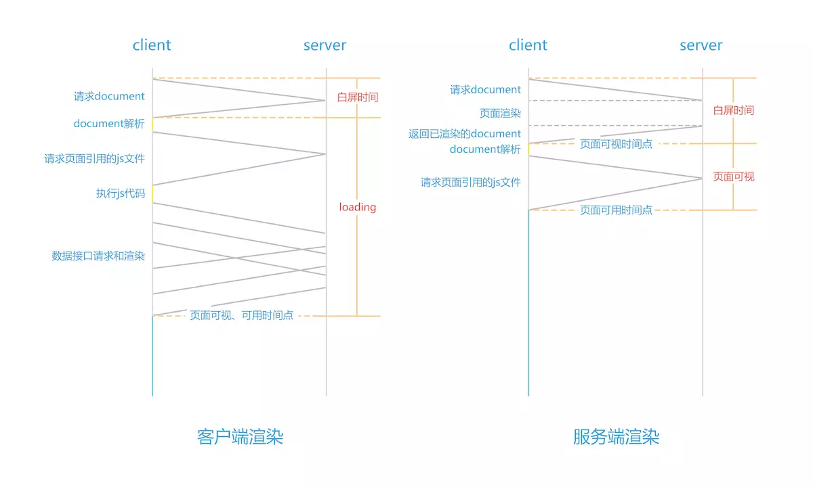

# 一、Next.js简介

React、Vue等框架部署的都是SPA单一页面，这样的页面会出现首屏加载过慢、SEO不便的问题，Next.js这样的SSR框架正是解决这种问题的服务器渲染框架。

其实把 next.js/nust.js 称为 SSR（服务器端渲染 Server Side Render）不太精确，应该是 Isomorphic render（**同构渲染**）。  

为了方便解释，我们引入几个概念。

- 数据：通常来自数据库，或者第三方服务等，比如用户的信息，订单详情等。数据使用某些数据结果来存储和传输，例如 json，xml，数组，Map 等 
- 模版：一个页面的基本轮廓和展示，模板定义了某个元素显示在什么位置。比如 PHP/JSP 就是模板语言，还有很多的模板引擎包括 Smarty/Jad/JSX 等 
- 页面：为了简化后面的说明，我们就把页面狭义的定义为 HTML。 再引入一个公式：  页面 = 模板 + 数据  上面的加号（+）并不是加法，它就是我们今天要讲到的渲染（Render）。

-   服务端渲染：渲染过程在服务器端完成，最终的渲染结果 HTML 页面通过 HTTP 协议发送给客户端。对于客户端而言，只是看到了最终的 HTML 页面，看不到数据，也看不到模板。 
- 客户端渲染：服务器端把模板和数据发送给客户端，渲染过程在客户端完成。 那么我们再对比一下，服务器端渲染的优势就是容易 SEO，首屏加载快，因为客户端接收到的是完整的 HTML 页面。这个时代，我称其为“Web Page”时代，我们开发的是网页，是给用户看的。  但是缺点也很明显：渲染过程在后端完成，那么肯定会耗费后端资源。费流量，即使局部页面的变化也需要重新发送整个页面等等 

对于客户端渲染，我们经常会讨论 React/Vue/Angular 三大框架，或者 SPA。这个时代，我称其为 “Web App”时代（SPA 中的 A 就是 Application 的首字母）。相比 Web Page 而言，我们现在开发的是 Web App，是给用户用的。  客户端渲染的优势是：节省后端资源，局部刷新页面，多端渲染，前后端分离。缺点是：首屏性能差，白屏，无法（或很难）进行 SEO 等等。 

对比一下就会发现一个很有意思的事，服务端渲染的优点就是客户端渲染的缺点，服务端渲染的缺点同时也是客户端渲染的优点，反之亦然。  

而 Next.js 做的是**同构渲染**。同一套代码既可以在服务器端渲染，也可以在客户端渲染。当我们首次访问时，换言之当我们访问首屏页面时，Next.js 使用服务器端渲染，为我们返回已经渲染完成的最终 HTML 页面。这样就同时解决了首屏白屏问题以及 SEO 问题。此后当我们再进行交互时，则使用客户端渲染。HTML、CSS、JS 等资源都不需要再重新请求，只需要通过 ajax/websocket 等途径获取数据，在客户端完成渲染过程。



Next.js 是一个轻量级的 React 服务端渲染应用框架。

优点：

- **完善的React项目架构，搭建轻松**。比如：Webpack配置，服务器启动，路由配置，缓存能力，这些在它内部已经完善的为我们搭建完成了。
- **自带数据同步策略，解决服务端渲染最大难点**。把服务端渲染好的数据，拿到客户端重用，这个在没有框架的时候，是非常复杂和困难的。
- **丰富的插件帮开发人员增加各种功能**。
- **灵活的配置，让开发变的更简单**。它提供很多灵活的配置项，可以根据项目要求的不同快速灵活的进行配置。

# 二、创建Next.js项目

## 1）如果不使用 `create-next-app`脚手架

```shell
mkdir nextdemo
cd nextdemo
yarn init //初始化成可管理的项目，其实就是在根目录里给你添加了一个package.json
yarn add react react-dom next //npm install --save react react-dom next
```

把常用的配置到`package.json`中

```json
"scripts": {
  "test": "echo \"Error: no test specified\" && exit 1",
  "dev" : "next dev" ,
  "build" : "next build",
  "start" : "next start -p 80"
},
```

根目录创建pages文件夹，这个是Next规定的，在这个文件夹下写入的文件，会自动创建对应的路由。在该文件夹下创建`index.js` 。

### 代码自动分割

不需要`import`其他内容，每个页面只会导入`import`中绑定以及被用到的代码.，也就是说并不会加载不需要的代码，包括 `import react`

```js
function Index(){
    return (
        <div>Hello Next.js</div>
    )
}
export default Index
```

## 2）使用 `create-next-app`脚手架

全局安装 `create-next-app`

```
yarn global add create-next-app
yarn create next-app demo01
```

### 目录结构

1. `pages`，以 `./pages`作为服务端的渲染和索引，在这个文件夹下写入的文件，会自动创建对应的路由。
2. `static`，静态文件服务目录，在根目录下新建文件夹叫`static`。代码可以通过`/static/xxx`来引入相关的静态资源。
3. `components`，放置通用组件，例如导航栏等。