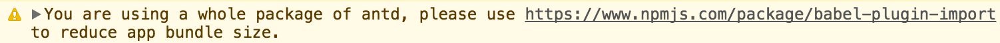

## 一、配置`Next.js`，使得支持CSS文件

- [@zeit/next-css](https://github.com/zeit/next-plugins/tree/master/packages/next-css)
- [@zeit/next-sass](https://github.com/zeit/next-plugins/tree/master/packages/next-sass)
- [@zeit/next-less](https://github.com/zeit/next-plugins/tree/master/packages/next-less)
- [@zeit/next-stylus](https://github.com/zeit/next-plugins/tree/master/packages/next-stylus)

1. 安装 `@zeit/next-css`

```shell
yarn @zeit/next-css
```

2. 在根目录新建 `next.config.js`，这个就是`Next.js`的总体配置文件

```js
const withCSS = require('@zeit/next-css')

module.exports = withCSS({
  /* config options here */
  cssModules: true
})
```

## 二、按需加载`Ant Design`

加载`Ant Design`在我们打包的时候会把`Ant Design`的所有包都打包进来，这样就会产生性能问题，让项目加载变的非常慢。这肯定是不行的，现在的目的是只加载项目中用到的模块，这就需要我们用到一个`babel-plugin-import`文件。

### 1）安装`Ant Design`UI 库

```shell
yarn add antd
```

### 2）安装和配置 `babel-plugin-import`

```shell
yarn add babel-plugin-import
```

1. 在项目根目录新建 .`babelrc` 文件，然后写入配置

```js
{
  "presets": ["next/babel"], //Next.js的总配置文件，相当于继承了它本身的所有配置
  "plugins": [ //增加新的插件，这个插件就是让antd可以按需引入，包括CSS
    [
      "import",
      {
        "libraryName": "antd",
        "style": "true"
      }
    ]
  ]
}
```

> 这样配置好了以后，`webpack`就不会默认把整个`Ant Design`的包都进行打包到生产环境了，而是我们使用那个组件就打包那个组件，同样CSS也是按需打包的。

### 3）`Antd` 官方文档的按需引入

如果你在开发环境的控制台看到下面的提示，那么你可能使用了 `import { Button } from 'antd';` 的写法引入了 antd 下所有的模块，这会影响应用的网络性能。

```null
You are using a whole package of antd, please use https://www.npmjs.com/package/babel-plugin-import to reduce app bundle size.
```

> 

可以通过以下的写法来按需加载组件。

```jsx
import Button from 'antd/es/button';
import 'antd/es/button/style'; // 或者 antd/es/button/style/css 加载 css 文件
```

> 注意：antd 默认支持基于 ES module 的 tree shaking，对于 js 部分，直接引入 `import { Button } from 'antd'` 也会有按需加载的效果。

如果你使用了 babel，那么可以使用 [babel-plugin-import](https://github.com/ant-design/babel-plugin-import) 来进行按需加载，加入这个插件后。你可以仍然这么写：

```jsx
import { Button } from 'antd';
```

插件会帮你转换成 `antd/es/xxx` 的写法。另外此插件配合 [style](https://github.com/ant-design/babel-plugin-import#usage) 属性可以做到模块样式的按需自动加载。

> 注意，babel-plugin-import 的 `style` 属性除了引入对应组件的样式，也会引入一些必要的全局样式。如果你不需要它们，建议不要使用此属性。你可以 `import 'antd/dist/antd.css'` 手动引入，并覆盖全局样式。