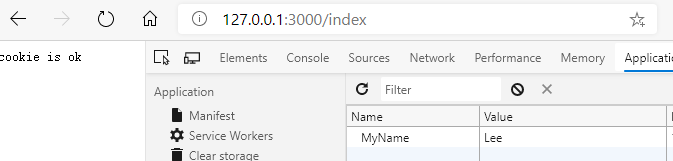

## `Koa2`中使用`Cookie`

### 1）写入Cookie操作：

开发中制作登录和保存用户信息在本地，最常用的就是`cookie`操作。比如我们在作一个登录功能时，希望用户在接下来的一周内都不需要重新登录就可以访问资源，这时候就需要我们操作`cookie`来完成我们的需求。

koa的上下文（`ctx`）直接提供了读取和写入的方法。

- `ctx.cookies.get(name,[optins])`：读取上下文请求中的`cookie`。
- `ctx.cookies.set(name,value,[options])`：在上下文中写入`cookie`。

示例代码：

```json
const Koa = require('koa');
const app = new Koa();

app.use(async (ctx) => {
  if (ctx.url === '/index') {
    ctx.cookies.set(
      'MyName', 'Lee'
    );
    ctx.body = 'cookie is ok';
  } else {
    ctx.body = 'hello world'
  }
});

app.listen(3000, () => {
  console.log('[demo] server is starting at port 3000');
})
```



### 2）Cookie选项

比如我们要存储用户名，保留用户登录状态时，你可以选择7天内不用登录，也可以选择30天内不用登录。这就需要在写入是配置一些选项：

- `domain`：写入cookie所在的域名
- `path`：写入cookie所在的路径
- `maxAge`：Cookie最大有效时长（毫秒）
- `expires`：cookie失效时间（new Date('2018-12-31')）
- `httpOnly`：是否只用http请求中获得
- `overwirte`：是否允许重写

```js
ctx.cookies.set(
  'MyName', 'Lee' , {
    domain:'127.0.0.1',
    //....
  }
);
```

