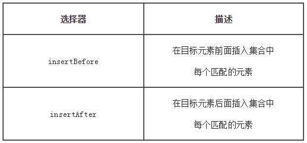

# jQuery的DOM操作

## 一、`DOM`的创建

### 1）创建节点和节点属性

**创建为属性节点**：

与创建元素节点同样的方式

```
$("<div id='test' class='aaron'>我是文本节点</div>")
```

## 二、`DOM`的插入

### 1）内部插入


> append()前面是被插入的对象，后面是要在对象内插入的元素内容 
>
> appendTo()前面是要插入的元素内容，而后面是被插入的对象


> .prepend()方法将指定元素插入到匹配元素里面作为它的第一个子元素 (如果要作为最后一个子元素插入用.append()).

### 2）外部插入




> - .before()和.insertBefore()实现同样的功能。主要的区别是语法——内容和目标的位置。 对于before()选择表达式在函数前面，内容作为参数，而.insertBefore()刚好相反，内容在方法前面，它将被放在参数里元素的前面
> - .after()和.insertAfter() 实现同样的功能。主要的不同是语法——特别是（插入）内容和目标的位置。 对于after()选择表达式在函数的前面，参数是将要插入的内容。对于 .insertAfter(), 刚好相反，内容在方法前面，它将被放在参数里元素的后面

## 三、`DOM`的删除

### 1）`empty()`

empty 顾名思义，清空方法，但是与删除又有点不一样，因为它只移除了 指定元素中的所有子节点。

这个方法不仅移除子元素（和其他后代元素），同样移除元素里的文本。

```html
<div class="hello"><p>慕课网</p></div>
```

如果我们通过empty方法移除里面div的所有元素，它只是清空内部的html代码，但是标记仍然留在DOM中

```html
//通过empty处理
$('.hello').empty()

//结果：<p>慕课网</p>被移除
<div class="hello"></div>
```

### 2）`remove()`的有参用法和无参用法

> remove与empty一样，都是移除元素的方法，但是remove会将元素自身移除，同时也会移除元素内部的一切，包括绑定的事件及与该元素相关的jQuery数据。

**remove表达式参数：**

remove比empty好用的地方就是可以传递一个选择器表达式用来过滤将被移除的匹配元素集合，可以选择性的删除指定的节点

我们可以通过$()选择一组相同的元素，然后通过remove（）传递筛选的规则，从而这样处理

对比右边的代码区域，我们可以通过类似于这样处理

```
$("p").filter(":contains('3')").remove()
```

## 四、`DOM`的复制和替换

## 五、`jQuery`的遍历

