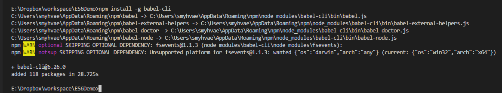
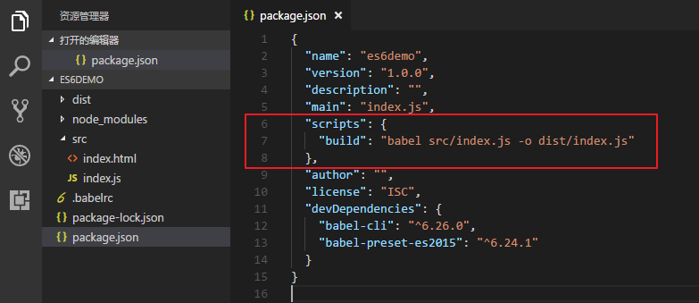

## ES6介绍和环境配置

ECMAScript 是 JS 的语言标准。而 ES6 是新的 JS 语法标准。

### 环境配置（Babel）

掌握 ES6 之后，如果要考虑 ES5 的兼容性，可以这样做：写 ES6 语法的 js 代码，然后通过 `Babel`将 ES6 转换为 ES5

### 建立工程目录

（1）先建立一个空的工程目录 `ES6Demo`，并在目录下建立两个文件夹 `src`和 `dist`：

- `src`：书写ES6代码，我们写的 js 程序都放在这里。
- `dist`：利用 Babel 编译生成的 ES5 代码。**我们在 HTML 页面需要引入 dist 里的 js 文件**。

（2）在 src 里新建文件 `index.html`：

```html
<!DOCTYPE html>
<html lang="en">
<head>
    <meta charset="UTF-8">
    <meta name="viewport" content="width=device-width, initial-scale=1.0">
    <meta http-equiv="X-UA-Compatible" content="ie=edge">
    <title>Document</title>
    <!-- 我们引入 ES5 中的 js 文件，而不是引入 ES6 中的 js 文件。 -->
    <script src="./dist/index.js"></script>
</head>
<body>
</body>
</html>
```

**注意**，上方代码中，我们引入的是`dist`目录下的 js 文件。

然后我们新建文件 `src/index.js`：

```js
let a = 'smyhvae';
const b = 'qianguyihao';

console.log(a);
console.log(b);
```

这个文件是一个 ES6语法 的js文件，稍后，我们尝试把这个 ES6 语法的 js 文件转化为 ES5 的 js 文件。

PS：我们在写代码时，能用单引号尽量用单引号，而不是双引号，前者在压缩之后，程序执行会更快。

### 全局安装 Babel-cli

（1）初始化项目：

在安装Babel之前，需要先用 npm init 先初始化我们的项目。打开终端或者通过cmd打开命令行工具，进入项目目录，输入如下命令：

```
	npm init -y
```

上方代码中，`-y` 代表全部默认同意，就不用一次次按回车了（稍后再根据需要，在文件中手动修改）。命令执行完成后，会在项目的根目录下生成package.json文件：

```
{
  "name": "es6demo",
  "version": "1.0.0",
  "description": "",
  "main": "index.js",
  "scripts": {
    "test": "echo \"Error: no test specified\" && exit 1"
  },
  "author": "smyhvae",
  "license": "ISC"
}
```

PS：VS Code 里打开终端的快捷键是：`Contol + ~`。

（2）安装 Babel：

在终端中输入以下命令：

```
	npm install --save-dev @babel/core
```



如果安装比较慢的话，Mac 下可以使用`cnpm`进行安装 ，windows 下可以使用`nrm`切换到 taobao 的镜像。

（3）本地安装 babel-preset-env(转码规则) 和 babel-cli：

```
# 最新转码规则
$ npm install --save-dev @babel/preset-env

# react 转码规则
$ npm install --save-dev @babel/preset-react

# cli 命令行工具
npm install --save-dev @babel/cli
```

安装完成后，会发现`package.json`文件，已经多了 devDependencies 选项：


（4）新建.babelrc：

在根目录下新建文件`.babelrc`，输入如下内容：

```
{
    "presets": [
      "@babel/env",
      "@babel/preset-react"
    ],
    "plugins": []
}
```

（5）开始转换：

现在，我们应该可以将 ES6 的文件转化为 ES5 的文件了，命令如下：（此命令略显复杂）

```
	npx babel src/index.js -o dist/index.js
```

我们可以将上面这个命令进行简化一下。操作如下：

在文件 `package.json` 中修改键 `scripts`中的内容：

```
  "scripts": {
    "build": "npx babel src/index.js -o dist/index.js"
  },
```

修改后的效果如下：



目前为止，环境配置好了。以后，我们执行如下命令，即可将`src/index.js`这个 ES6 文件转化为 `dist/index.js`这个 ES5 文件：

```
	npm run build
```

我们执行上面的命令之后，会发现， dist目录下会生成 ES5 的 js 文件：

index.js：

```js
	'use strict';

	var a = 'smyhvae';
	var b = 'qianguyihao';

	console.log(a);
	console.log(b);
```

### babel/polyfill

Babel 默认只转换新的 JavaScript 句法（syntax），而不转换新的 API，比如`Iterator`、`Generator`、`Set`、`Map`、`Proxy`、`Reflect`、`Symbol`、`Promise`等全局对象，以及一些定义在全局对象上的方法（比如`Object.assign`）都不会转码。

安装命令如下。

```bash
$ npm install --save-dev @babel/polyfill
```

然后，在脚本头部，加入如下一行代码。

```javascript
import '@babel/polyfill';
// 或者
require('@babel/polyfill');
```