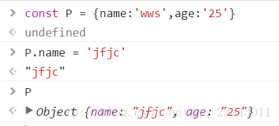
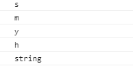

##  ES6的变量

ES6 中新增了 let 和 const 来定义变量：

- `var`：ES5 和 ES6中，定义**全局变量**（是variable的简写）。
- `let`：定义**局部变量**，替代 var。
- `const`：定义**常量**（定义后，不可修改）。

### var：全局变量

看下面的代码：

```js
	{
	    var a = 1;
	}

	console.log(a);   //这里的 a，指的是 区块 里的 a
```

上方代码是可以输出结果的，输出结果为 1。因为 var 是全局声明的，所以，即使是在区块里声明，但仍然在全局起作用。

再来看下面这段代码：

```js
	var a = 1;
	{
	    var a = 2;
	}

	console.log(a);   //这里的 a，指的是 区块 里的 a
```

上方代码的输出结果为 2 ，因为 var 是全局声明的。

**总结：**

用 var 定义的全部变量，有时候会污染整个 js 的作用域。

### let：定义局部变量

```js
	var a = 2;
	{
	    let a = 3;
	}

	console.log(a);
```

上方代码的输出结果为 2。用 let 声明的变量，只在局部（块级作用域内）起作用。

let是防止数据污染，我们来看下面这个 **for 循环**的例子，很经典。

1、用 var 声明变量：（）

```js
for (var i = 0; i < 10; i++) {
    console.log('循环体中:' + i); // 每循环一次，就会在 { } 所在的块级作用域中，重新定义一个新的 i
}

console.log('循环体外:' + i);
```

上方代码可以正常打印结果，且最后一行的打印结果是10。说明循环体外定义的变量 i，是在全局起作用的。

2、用let声明变量：

```js
for (let i = 0; i < 10; i++) {
    console.log('循环体中:' + i);
}

console.log('循环体外:' + i);
```

上方代码的最后一行无法打印结果，也就是说打印会报错。因为用 let 定义的变量 i，只在`{ }`这个**块级作用域**里生效。

**总结：我们要习惯用 let 声明，减少var声明带来的污染全局空间**。

为了进一步说明 let 不会带来污染，需要说明的是：当我们定义了`let a = 1`时，如果我们在同一个作用域内继续定义`let a = 2`，是会报错的。

### const：定义常量

在程序开发中，有些变量是希望声明后，在业务层就不再发生变化，此时可以用 const 来定义。

举例：

```
const name = 'smyhvae';  //定义常量
```

用 const 声明的变量，只在局部（块级作用域内）起作用。

- **如果是值类型，值不可变**

- **const 指针指向的地址不可以变化，指向地址的内容可以变化**（比如一个array中，可以修改array中的值，但不能修改array整个对象）

  

### let 和 const 的作用【重要】

let 和 const 的作用如下：

- 禁止重复声明
- 支持块级作用域
- 控制修改

相反， 用`var`声明的变量：可以重复声明、**没有块级作用域**、不能限制。

## 变量的解构赋值

ES6允许我们，通过数组或者对象的方式，对一组变量进行赋值，这被称为解构。

解构赋值在实际开发中可以大量减少我们的代码量，并且让程序结构更清晰。

### 数组的解构赋值

**举例：**

通常情况下，我们在为一组变量赋值时，一般是这样写：

```js
	let a = 0;
	let b = 1;
	let c = 2;
```

现在我们可以通过数组解构的方式进行赋值：

```js
	let [a, b, c] = [1, 2, 3];
```

二者的效果是一样的。

**解构的默认值：**

在解构赋值时，是允许使用默认值的。举例如下：

```js
{
    //一个变量时
    let [foo = true] = [];
    console.log(foo); //输出结果：true
}

{
    //两个变量时
    let [a, b] = ['生命壹号']   //a 赋值为：生命壹号。b没有赋值
    console.log(a + ',' + b); //输出结果：生命壹号,undefined
}


{
    //两个变量时
    let [a, b = 'smyhvae'] = ['生命壹号']   //a 赋值为：生命壹号。b 采用默认值 smyhvae
    console.log(a + ',' + b); //输出结果：生命壹号,smyhvae
}
```

`undefined`和`null`的区别：

如果我们在赋值时，采用的是 `undefined`或者`null`，那会有什么区别呢？

```js
{
    let [a, b = 'smyhvae'] = ['生命壹号', undefined]; //b 虽然被赋值为 undefined，但是 b 会采用默认值
    console.log(a + ',' + b); //输出结果：生命壹号,smyhvae
}

{
    let [a, b = 'smyhvae'] = ['生命壹号', null];  //b 被赋值为 null
    console.log(a + ',' + b); //输出结果：生命壹号,null
}
```

上方代码分析：

- undefined：相当于什么都没有，此时 b 采用默认值。
- null：相当于有值，但值为 null。

### 对象的解构赋值

通常情况下，我们从接口拿到json数据后，一般这么赋值：

```js
var a = json.a;

var b = json.b;

bar c = json.c;
```

上面这样写，过于麻烦了。

现在，我们同样可以针对对象，进行结构赋值。

**举例如下：**

```js
let { foo, bar } = { bar: '我是 bar 的值', foo: '我是 foo 的值' };
console.log(foo + ',' + bar); //输出结果：我是 foo 的值,我是 bar 的值
```

上方代码可以看出，对象的解构与数组的结构，有一个重要的区别：**数组**的元素是按次序排列的，变量的取值由它的**位置**决定；而**对象的属性没有次序**，是**根据键来取值**的。

**圆括号的使用**：

如果变量 foo 在解构之前就已经定义了，此时你再去解构，就会出现问题。下面是错误的代码，编译会报错：

```js
	let foo = 'haha';
	{ foo } = { foo: 'smyhvae' };
	console.log(foo);
```

要解决报错，只要在解构的语句外边，加一个圆括号即可：

```js
	let foo = 'haha';
	({ foo } = { foo: 'smyhvae' });
	console.log(foo); //输出结果：smyhvae
```

### 字符串解构

字符串也可以解构，这是因为，此时字符串被转换成了一个类似数组的对象。举例如下：

```
const [a, b, c, d] = 'smyhvae';
console.log(a);
console.log(b);
console.log(c);
console.log(d);

console.log(typeof a);  //输出结果：string
```

输出结果：



## for ... of 循环

ES6 中，如果我们要遍历一个数组，可以这样做：

```js
	let arr1 = [1, 2, 3, 4, 5];

	for (let value of arr1) {
	    console.log(value);
	}
```

for…of 的循环可以避免我们开拓内存空间，增加代码运行效率，所以建议大家在以后的工作中使用for…of循环。

注意，上面的数组中，`for ... of`获取的是数组里的值；`for ... in`获取的是index索引值。

### Map对象的遍历

`for ... of`既可以遍历数组，也可以遍历Map对象。

## 模板字符串

我们以前让字符串进行拼接的时候，是这样做的：（传统写法的字符串拼接）

```js
    var name = 'smyhvae';
    var age = '26';
    console.log('name:'+name+',age:'+age);   //传统写法
```

这种写法，比较繁琐，而且容易出错。

现在有了 ES6 语法，字符串拼接可以这样写：

```js
    var name = 'smyhvae';
    var age = '26';

    console.log('name:'+name+',age:'+age);   //传统写法

    console.log(`name:${name},age:${age}`);  //ES6 写法
```

**注意**，上方代码中，倒数第二行用的符号是单引号，最后一行用的符号是反引号（在tab键的上方）。