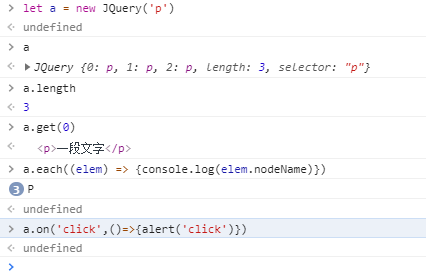

如何手写一个简易JQuery，考虑插件和扩展性

```js
class jQuery {
  constructor(selector) {
      const result = document.querySelectorAll(selector)
      const length = result.length
      for (let i = 0; i < length; i++) {
          this[i] = result[i]
      }
      this.length = length
      this.selector = selector
  }
  get(index) {
      return this[index]
  }
  each(fn) {
      for (let i = 0; i < this.length; i++) {
          const elem = this[i]
          fn(elem)
      }
  }
  on(type, fn) {
      return this.each(elem => {
          elem.addEventListener(type, fn, false)
      })
  }
  // 扩展很多 DOM API
}
```

结果：



插件和复写（造轮子）

```js
//插件
JQuery.prototype.a = function(info) {
  alert(info)
}
//造轮子
class myJQuery extends JQuery {
  constructor(selector) {
    super(selector)
  }
  //各类方法
}
```

