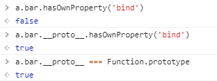

## 手写一个call

`call`核心：

- 函数定义在哪里 ?

  call是可以被所有方法调用的,所以毫无疑问的定义在 Function的原型上!

- 函数接收参数 ?

  绑定函数被调用时只传入第二个参数及之后的参数，如果不传入参数，默认指向为window

- 如何显式绑定this ?

  如果调用者函数，被某一个对象所拥有，那么该函数在调用时，内部的this指向该对象。



```jsx
Function.prototype.call2 = function (content = window) {
  //content就是foo，content没有时为window
  content.fn = this;
  // this为a.bar方法
  // content.fn就是bar方法
  //将当前被调用的方法bar定义在content.fn上（为了能以对象调用的形式绑定this）
  let arg = [...arguments].slice(1);
  //获取传入的所有参数，并去除foo
  let res = content.fn(...arg);
  //以对象调用的形式执行fn，此时this指向content，也就是传入的需要绑定的this指向
  delete content.fn;
  // 因为有可能this函数会有返回值return，防止环境污染
  return res
}

let foo = {
  name: 'white',
  age: '20'
}
let a = {
  name: 'black',
  age: '18',
  bar: function(value) {
    console.log(this.name + this.age + value)
  }
}

a.bar.call2(foo,'haha') //white20haha
```

## 手写一个bind

```js
Function.prototype.bind2 = function () {
  const res = [...arguments];
  const t = res.shift();//去除数组的第一个并返回
  const self = this;//this是a.bar（谁执行就是谁）
  return function() {
    return self.apply(t,res)
  }
}
a.bar.bind2(foo,'black','18')()//返回的是函数，加()立即执行
```

## 实际中闭包的应用

- 隐藏数据

```jsx
// 闭包隐藏数据，只提供 API
function createCache() {
  const data = {} // 闭包中的数据，被隐藏，不被外界访问
  return {
      set: function (key, val) {
          data[key] = val
      },
      get: function (key) {
          return data[key]
      }
  }
}

const c = createCache()
c.set('a', 100)
console.log( c.get('a') )
```

## 创建10个a标签，内容为序号，点击弹出序号

```js
let a
for (let i = 0; i < 10; i++) {
  a = document.createElement('a')
  a.innerHTML = i + '<br>'
  a.addEventListener('click', function (e) {
      e.preventDefault()
      alert(i)
  })
  document.body.appendChild(a)
}
```

`i` 不能定义在全局中，不然会出现点击都是10。

只有放在for这个块作用域中，每次循环都是生成新的块，每次都是新的作用域