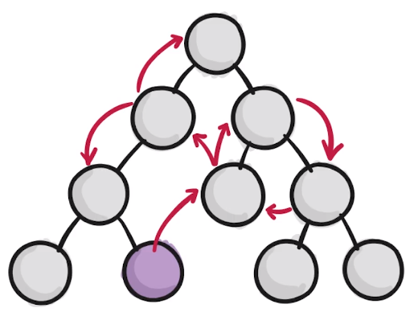

## 细节补充

1. 在create-react-app脚手架生成的原生代码中，src/index.js里面，有个：

   ```jsx
   import * as serviceWorker from './serviceWorker';
   ```

   serviceWorker是PWA(progressive web application)，当我们把网页放在https服务器上时，用户第一次访问后，断网依旧可以使用该网页。

2. `render()`函数返回的元素必须有一个包裹元素，类似`<div>`这样的大的标签，如果不想显示`<div>`这样的大标签，可以使用`<Fragment>`，并不会在浏览器中显示。

3.  ==class 类==不管是原型方法还是静态方法定义，“this”值在被调用的函数内部将为 undefined，为了避免这个问题只能==强制去绑定this==。

4. this.state.inputValue延迟问题：由于==setState是异步的==，当一个异步过程调用发出后，调用者不会立刻得到结果。而是在"调用"发出后，"被调用者"通过状态、通知来通知调用者，或通过回调函数处理这个调用。

5. ==immutable概念==：当对state数据有直接修改数据的需求时，最好通过复制副本来操作，使其指向新的数组。

6. `dangerouslySetInnerHTML = {{__html: item}}`:使内容不被转义（`<h1>`之类的标签不显示文本，直接成为样式），第一个花括号是由于在标签中使用表达式，第二个是指内容为 JS 对象

7. setState的写法：
    ```js
    handleItemClick(index){
       this.setState((prevState) => {
         //这个花括号返回的是函数体
         //prevState代替this.state
         const list = prevState.list;
         list.splice(index,1);
         //这个花括号返回对象，list: list 可以直接list
         return {list}
       });
    }
    ```
8. 如果标签中的方法太长，可以拆分出来用函数代替：

   ```jsx
   <ul>
   	{this.getItem()}
   </ul>
   //拆分
   getItem() {
     return this.state.list.map((item, index) => {
       return (
         <TodoItem
           content={item}
           index={index}
           key={index}
           deleteItem={this.handleItemClick}
         />
       )
     }
     )
   }
   ```

   ## 知识点

1. 声明式开发和命令式开发的区别：
   - JQuery是命令式开发，直接操作DOM
   - React是声明式开发，是面向数据的，React根据数据来构建DOM

2. 子父组件的通信：

   父组件向子组件传**只读**的值props（单向数据流），子组件接受，如果子组件要向父组件传值，需要调用父组件传递过来的方法

3. React是视图层框架：

   如果出现像下图这样组件层级多的数据交互，涉及到了父子组件的多层传值问题，太过复杂，所以需要配合类似Redux、Mobx等数据层框架来辅助开发

   

