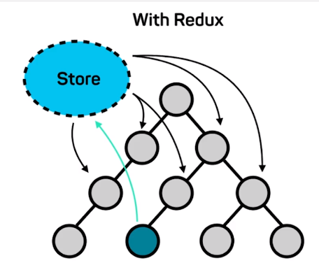
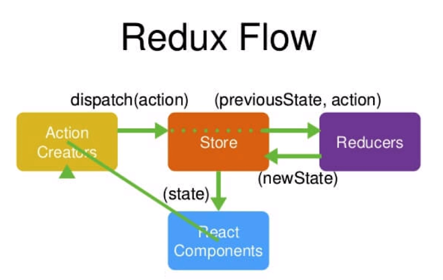
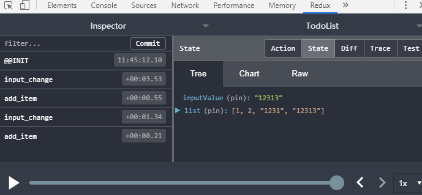

## Redux概念简述

1. 数据放在公共存储区域Store中



当蓝色组件改变数据传递给其他组件时，就改变Store中的数据，其他组件自动去Store去新的数据

2. Redux = Reducer + Flux

## Redux的工作流程



- ReactComponents：借书的用户

- ActionCreators：说的借什么书的话

- Store：图书馆管理员

- Reducers：图书馆管理员查阅的记录本

## 使用Antd编写TodoList

[Ant Design官方文档](https://ant.design/docs/react/introduce-cn)

```jsx
import { Input , Button ,List } from 'antd';
import 'antd/dist/antd.css';

<div>
  <div style={{margin:'10px'}}>
    <Input 
      placeholder="hh"
      style={{width: '300px', marginRight: '10px'}}>
    </Input>
    <Button type="primary">提交</Button>
  </div>
  <List
    style={{width: '300px' , margin:'10px'}}
    size="small"
    bordered
    dataSource={data}
    renderItem={item => <List.Item>{item}</List.Item>}
  />
</div>
```

## Store的创建

创建src/store/index.js和src/store/reducer.js

index.js

```jsx
import { createStore } from 'redux';
import reducer from './reducer';

const store = createStore(reducer);

export default store;
```

reducer.js（**纯函数**）

```jsx
const defaultStore = {
  inputValue: 123,
  list: [1, 2]
}

export default ( state = defaultStore, action) => {
  return state;
}
```

app.js

```jsx
import store from './store'

constructor(props){
  super(props);
  this.state = store.getState();
}

<Input 
  placeholder={this.state.inputValue} 
  style={{width: '300px', marginRight: '10px'}}>
</Input>
```

## Action和Reducer的编写

安装Redux的DevTools，在创建Store时增加一行代码

```jsx
const store = createStore(
  reducer,
  window.__REDUX_DEVTOOLS_EXTENSION__ && window.__REDUX_DEVTOOLS_EXTENSION__()
);
```

用于查看state的变化和对应的type



## 更新的流程

```jsx
constructor(props){
  super(props);
  this.state = store.getState();
  store.subscribe(this.handleStoreChange);
}
```

- `store.getState()`获取state后赋值给组件的state
- `store.subscribe()`注册监听，调用对应的方法

```jsx
  handleInputChange(e) {
    const action = {
      type: 'input_change',
      value: e.target.value,
    }
    store.dispatch(action);
  }
  handleStoreChange() {
    this.setState(store.getState())
  }
```

- 在组件的监听方法中 定义==action对象==：
  - type：这个action的类型，用于Reducer判断改变的值
  - vaule：在Reducer中通过`action.value`进行数据改变
- `store.dispatch(action)`：将action传递给Store，==Store会将之前的`（state,action）`后自动传给Reducer==
- `this.setState(store.getState())`：用于组件更新从Store中传来的数据

```jsx
export default ( state = defaultStore, action) => {

  if(action.type === 'input_change') {
    const newState = JSON.parse(JSON.stringify(state));
    newState.inputValue = action.value;
    return newState;
  }
  if(action.type === 'add_item') {
    const newState = JSON.parse(JSON.stringify(state));
    newState.list.push(newState.inputValue);
    newState.inputValue='';
    return newState;
  }

  return state;
}
```

在Reducer中判断`action.type`进行数据的操作

==**注意**：Reducer不能修改State的值，所以对State进行了深拷贝后修改，再返回新的State到Store，Store用新的State替换之前的数据，Store中数据发生改变，由于组件对Store进行了`Subscribe`监听，组件便会重新向Store取数据。==

# 知识点补充

1. Redux的三大原则：

   - Store是唯一的

   - 只有Store能改变自己的内容
   - Reducer必须是纯函数（指的是给定固定的输入，就一定会有固定的输出，并且不会有副作用）

2. Redux核心API

   - createStore：创建一个store

   - store.dispatch：派发action给Store
   - store.getState：组件用于获取Store中的内容
   - store.subscribe：组件订阅Store的改变，来执行回调函数

