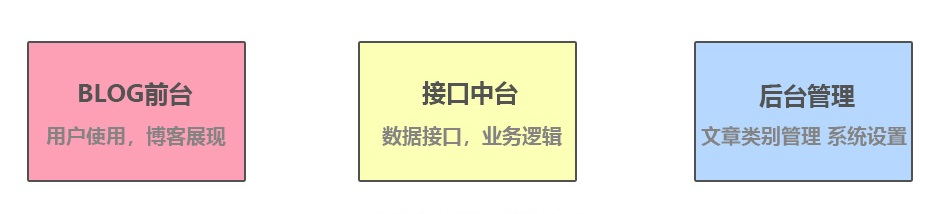

## 一、项目说明

### 1）BLOG 前台

- 用户访问、文章列表、文章详情

- 需要SEO操作，使用`Next.js`
- `Ant Design`作为UI交互库

1. 使用 `Next.js` 
2. 安装`Antd`以及`babel-plugin-import`，实现`Antd`的按需引入
3.  新增`.babelrc`、在`pages`下新建 `_app.js`实现全局引入
4.  安装`@zeit/next-css`包，实现`Next.js`的CSS支持

> 具体配置文件在我的笔记《Notes\Node相关\1. Next.js-React服务端渲染\7. Next框架下使用Antd.md》和 《Notes\Node相关\1. Next.js-React服务端渲染\8. Next.js生成环境打包.md》

### 2）`egg.js`中台

博客系统的服务端（或者叫做中台），采用`Koa`的上层框架`egg.js`

### 3）react-hooks+antd_layout

使用`antd_layout`完成布局（使用了侧边布局）