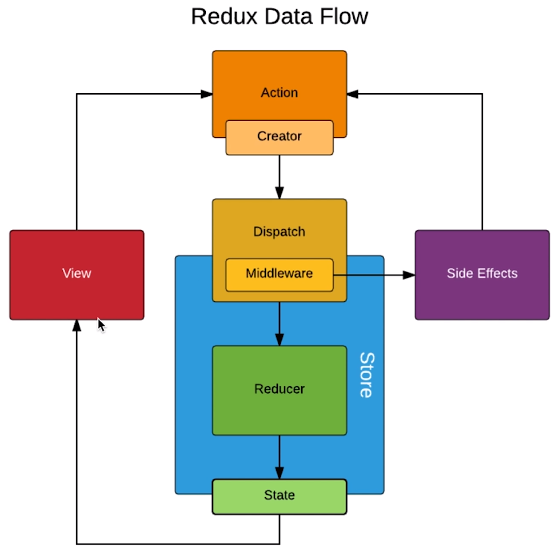

## *UI* 组件与容器组件的拆分

- UI 组件负责页面的渲染
- 容器组件负责页面的逻辑

容器组件作为父组件，UI 组件使用Pros接受父组件的传值。

**注意**：当父组件向子组件传递方法时，如果父组件的方法需要传入值来调用，则不适用bind绑定，使用箭头函数：

```jsx
onClick={() => {this.props.handleItemClick(index)}}
```

## 无状态组件

优势：性能更优，没有生命周期函数，（当一个类只有`render()`时，可以使用，大部分UI组件用无状态组件）

```jsx
const TodoListUI = (props) => {
  return (
    <div>{props.value}</div>
  )
}
```

## Redux中发送异步请求获取数据

同之前的在`\WEB前端\React实战 简书项目\02. React 进阶内容.md`的Axios使用一样，但是需要走Redux的数据交互流程。（注意JSON文件中字符串要使用双引号，不能 单引号）

```jsx
componentDidMount(){
  axios.get('http://localhost.charlesproxy.com:3000/api/todolist.json')
    .then((res) => {
      const data = res.data;
      const action = initTodoItemAction(data);
      store.dispatch(action);
    })
}
```

## 使用Redux-thunk中间件实现ajax数据请求

[Redux-thunk](https://github.com/reduxjs/redux-thunk) 用来实现异步请求，有助于自动化测试与代码的拆分管理。

Redux-thunk可以使得Action是函数，编写返回函数，该返回函数接收存储方法 `dispatch`和`getState`作为参数。

```shell
npm install redux-thunk
```

在createStore中，由于已经使用了DevTools，而thunk需要使用`applyMiddleware()`方法，所以如果要使用thunk，需要根据[redux-dev-tools文档](https://github.com/zalmoxisus/redux-devtools-extension)中的1.2 Advanced store setup来调整

```jsx
import { createStore ,applyMiddleware ,compose } from 'redux';
import reducer from './reducer';
import thunk from 'redux-thunk';

const composeEnhancers = window.__REDUX_DEVTOOLS_EXTENSION_COMPOSE__ || compose;
const enhancer = composeEnhancers(applyMiddleware(thunk));
const store = createStore(reducer,enhancer);
```

- 在组件中：

```jsx
componentDidMount(){
  const action = getTodoItemAction();
  store.dispatch(action);
}
```

  action可以通过thunk赋值为函数，当store的dispatch方法传递action时，可以直接执行这个函数。

- 在actionCreators中：

```jsx
export const getTodoItemAction = () => {
  return (dispatch) => {
    axios.get('http://localhost.charlesproxy.com:3000/api/todolist.json')
    .then((res) => {
      const data = res.data;
      const action = initTodoItemAction(data);
      dispatch(action);
    })
  }
};
```

这个函数返回的是一个函数，该可以自动获取dispatch方法，用于传递action对象

## Redux中间件



中间件顾名思义：指的是Action和Store之间，对Dispatch的一种封装

> 例如Redux-thunk，当Action传递一个对象时，Dispatch会直接给Store，但是当Action传递一个函数时，Dispatch会先让函数先执行，需要调用Store才传递对象

## Redux-saga 中间件的使用

[Redux-saga文档](https://github.com/redux-saga/redux-saga)

同样是处理异步请求的中间件，但是不同于Redux-thunk将异步代码放在Action中，Redux-saga 是将异步代码单独放在一个文件

在Creators中

```jsx
import createSagaMiddleware from 'redux-saga';
import todoSages from './sagas'

const sagaMiddleware = createSagaMiddleware();
const composeEnhancers = window.__REDUX_DEVTOOLS_EXTENSION_COMPOSE__ || compose;
const enhancer = composeEnhancers(applyMiddleware(sagaMiddleware));

const store = createStore(reducer, enhancer);
sagaMiddleware.run(todoSages);
```

saga.js中

```jsx
import { takeEvery , put } from 'redux-saga/effects'
import { Get_Init_List } from './actionTypes'
import { initTodoItemAction } from './actionCreators'
import axios from 'axios';

function* getInitList(){
  try{
    const res = yield axios.get('http://localhost.charlesproxy.com:3000/api/todolist.json')
    const action = initTodoItemAction(res.data);
    yield put(action);
  }catch{
    console.log('获取Init_List失败');
  }
  
}

function* todoSages() {
  yield takeEvery(Get_Init_List, getInitList);
}

export default todoSages;
```

使用了Generator 函数，不用Promise的形式发送异步请求

**流程**：做完saga的基础设置后，组件向Store发送action，不止Reducer能接受到，todosaga也能接受到，`takeEvery(Get_Init_List, getInitList)`判断action中的Type来调用对应的异步函数，通过PUT方法传action给Store。

## ==React-Redux的使用==

在最高级组件中使用Provider API，该提供器连接Store使得其所有的子组件都可以获取Store的数据

```jsx
import { Provider } from 'react-redux';
import store from './store';

const App = (
  <Provider store = {store}>
    <TodoList />
  </Provider>
)
ReactDOM.render(App, document.getElementById('root'));
```

那么在子组件TodoList中通过connect定义该组件根据`mapStateToProps`和`mapDispatchToProps`规则来连接Store，将这些映射关系和业务逻辑集成到了TodoList中，这样就使该组件成为了容器组件。

```jsx
import { connect } from 'react-redux';
export default connect(mapStateToProps,mapDispatchToProps)(TodoList);
```

TodoList.js

```jsx
import { connect } from 'react-redux';
const TodoList = (props) => {
  return (
    <div>
      <input
        value={props.inputValue}
        onChange={props.changeInputValue}
      />
    </div>
  )
}
//state为Store的state
const mapStateToProps = (state) => {
  return {
    inputValue: state.inputValue
  }
}
//dispatch为Store.dispatch
const mapDispatchToProps = (dispatch) => {
  return {
    changeInputValue(e) {
      const action = {
        type: 'input_change',
        inputValue: e.target.value
      }
    dispatch(action);
    }
  }
}

export default connect(mapStateToProps,mapDispatchToProps)(TodoList);
```

通过props来获取值和方法，`mapStateToProps()`来获取store中state的值，`mapDispatchToProps()`的`changeInputValue()`方法来传递action。