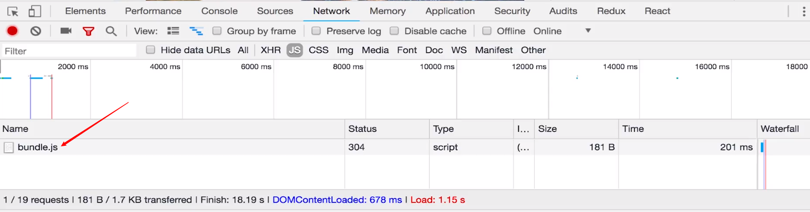

## 动态路由

在 首页的List 中路由跳转时加上 `ID`

```jsx
<Link key={index} to={'/detail/' + item.get('id')}>
  <ListItem >
    
    <ListInfo>
      <h3 className='title'>{item.get('title')}</h3>
      <p className='desc'>{item.get('desc')}</p>
    </ListInfo>
  </ListItem>
</Link>
```

在`App.js`中就需要改变之前的Route的path值，来确保调用Detail组件，Detail组件就可以直接拿到路由的信息，得到 `ID` 值

```jsx
<Route path='/detail/:id' exact component={Detail}></Route>
```

在 详情页面的 `componentDidMount() `时获取 `ID` 值并传入`actionCreators.js`

```jsx
componentDidMount() {
  //console.log(this.props)可以看到match.params.id
  this.props.getDetail(this.props.match.params.id);
}
const mapDispatch = (dispatch) => ({
	getDetail(id) {
		dispatch(actionCreators.getDetail(id));
	}
});
```

在`actionCreators.js`中根据id来

```jsx
export const getDetail = (id) => {
	return (dispatch) => {
		axios.get('/api/detail.json?id=' + id).then((res) => {
			const result = res.data.data;
			dispatch(changeDetail(result.title, result.content));
		}).catch(() => {
			alert('error');
		})
	}
};
```


### 另一种URL改法

在首页的List

```jsx
<Link key={index} to={'/detail?id=' + item.get('id')}>
  <ListItem >
    
    <ListInfo>
      <h3 className='title'>{item.get('title')}</h3>
      <p className='desc'>{item.get('desc')}</p>
    </ListInfo>
  </ListItem>
</Link>
```

在`App.js`就用之前的改法就可以了

```jsx
<Route path='/detail' exact component={Detail}></Route>
```

在`componentDidMount() `里获取id的就不同了

==同样是通过`console.log(this.props)`可以查看id值的位置==

```jsx
componentDidMount() {
  this.props.getDetail(
  );
}
const mapDispatch = (dispatch) => ({
	getDetail(id) {
		dispatch(actionCreators.getDetail(id));
	}
});
```

  `this.props.location.search`里面有id，显示`?id=xxx`，需要自己对这个字符串做处理

## 登录功能实现

```jsx
<LoginWrapper>
  <LoginBox>
    <Input placeholder='账号' innerRef={(input) => {this.account = input}}/>
    <Input placeholder='密码' type='password' innerRef={(input) => {this.password = input}}/>
    <Button onClick={() => this.props.login(this.account, this.password)}>登陆</Button>
  </LoginBox>
</LoginWrapper>
```

使用`styled-components`的`innerRef`方法获取两个input框的DOM，通过`.value`获取它的值。

同样传给`actionCreators.js`进行Ajax请求，Reducer进行store的操作

如果根据store中的值判断，登录成功使用`react-router-dom`中的`Redirect`组件做个重定向

```jsx
import { Redirect } from 'react-router-dom';

if (!loginStatus) {
  return (
    <LoginWrapper>
      <LoginBox>
        <Input placeholder='账号' innerRef={(input) => {this.account = input}}/>
        <Input placeholder='密码' type='password' innerRef={(input) => {this.password = input}}/>
        <Button onClick={() => this.props.login(this.account, this.password)}>登陆</Button>
      </LoginBox>
    </LoginWrapper>
  )
}else {
  return <Redirect to='/'/>
}
```

### 退出：

在**Header组件**中，做一个点击事件（login的值来自`login: state.getIn(['login', 'login'])`）,

```jsx
{
  login ? 
    <NavItem onClick={logout} className='right'>退出</NavItem> : 
    <Link to='/login'><NavItem className='right'>登陆</NavItem></Link>
}
```

`logout`方法定义在login组件的`actioncreators`中，那么所有的Reducer都能接收到这个action，在login组件的Reducer中进行处理

## 异步组件和withRouter路由方法的使用

进入首页的时候其实已经加载了其他页面的代码，全部通过bundle.js加载完毕了



但是如果页面过大的话，这样全部页面都加载，就会出现首页加载慢的问题，这时就该使用异步组件，可以用封装好的组件，例如 `React-Loadable`

[React-Loadable](https://github.com/jamiebuilds/react-loadable) 就可以实现进入某个页面后，再加载该页面

在需要使用的组件文件夹下创建`loadable.js`

```jsx
import React from 'react';
import Loadable from 'react-loadable';

const LoadableComponent = Loadable({
  loader: () => import('./'),
  loading() {
  	return <div>正在加载</div>
  }
});

export default () => <LoadableComponent/>
```

那在`App.js`中就应该访问`loadable.js`了

```jsx
import Detail from './pages/detail/loadable.js';
```

这样就把该组件变成了异步组件

**注意**：如果这样写那么之前使用的路由的参数 `id` 就需要修改了，现在App.js中加载的是loadable这个组件，不能直接拿到路由的信息，就需要在使用了loadable的组件的index页面修改

```jsx
import { withRouter } from 'react-router-dom';

export default connect(mapState, mapDispatch)(withRouter(Detail));
```

