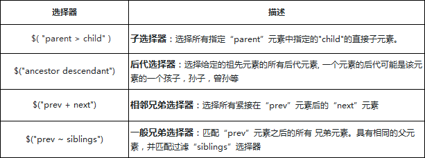

# 样式

## 一、初识`jQuery`

### 1）`jQuery`对象和`DOM`对象

> `jQuery` 对象与 `DOM` 对象是不一样的

```js
<p id=”imooc”></p>

// 普通处理，通过标准JavaScript处理：
var p = document.getElementById('imooc');
p.innerHTML = '您好！通过慕课网学习jQuery才是最佳的途径';
p.style.color = 'red';

//jQuery的处理：
var $p = $('#imooc');
$p.html('hello').css('color','red');
```

通过 `$('#imooc')` 方法会得到一个 `$p`的`jQuery`对象，`$p`是一个类数组对象。它与DOM对象完全不同，唯一相似的是它们都能操作DOM。

这个对象里面包含了`DOM`对象的信息，然后封装了很多操作方法，调用自己的方法html与css，得到的效果与标准的JavaScript处理结果是一致的。

#### 1.1.1 利用数组下标的方式读取到`jQuery`中的`DOM`对象

HTML代码

```html
<div>元素一</div>
<div>元素二</div>
<div>元素三</div>
```

JavaScript代码

```js
var $div = $('div') //jQuery对象
var div = $div[0] //转化成DOM对象
div.style.color = 'red' //操作dom对象的属性
```

用jQuery找到所有的div元素（3个），因为jQuery对象也是一个数组结构，可以通过数组下标索引找到第一个div元素，通过返回的div对象，调用它的style属性修改第一个div元素的颜色。

### 1.1.2 通过`jQuery`自带的`get()`方法

```js
var $div = $('div') //jQuery对象
var div = $div.get(0) //通过get方法，转化成DOM对象
div.style.color = 'red' //操作dom对象的属性
```

#### 1.1.3 `DOM`对象转化成`jQuery`对象

`$(DOM对象)`是一个多功能的方法，通过传递不同的参数而产生不同的作用。

```js
var div = document.getElementsByTagName('div'); //dom对象
var $div = $(div); //jQuery对象
var $first = $div.first(); //找到第一个div元素
$first.css('color', 'red'); //给第一个元素设置颜色
```

## 二、`jQuery` 选择器

1. `id` 选择器：`$( "#id" )`

2. 类选择器：`$( ".class" )`

3. 元素选择器：`$( "element" )` 搜索指定元素标签名的所有节点

4. 全选择器：`$( "*" )`

> 考虑一个兼容性的问题，比如:
>
> 1. IE会将注释节点实现为元素，所以在IE中调用`getElementsByTagName`里面会包含注释节点，这个通常是不应该的
> 2. `getElementById`的参数在IE8及较低的版本不区分大小写
> 3. IE7及较低的版本中，表单元素中，如果表单A的name属性名用了另一个元素B的ID名并且A在B之前，那么getElementById会选中A
> 4. IE8及较低的版本，浏览器不支持`getElementsByClassName`

5. 层级选择器：



6. 基本筛选选择器：

7. 内容筛选选择器：

8. 可见性筛选选择器：

9. 属性筛选选择器：

10. 子元素筛选选择器：

11. 表单元素选择器：

12. 表单对象属性选择器：

13. 特殊选择器this：

    ```js
    p.addEventListener('click',function(){
        //this === p
        //以下两者的修改都是等价的
        this.style.color = "red";
        p.style.color = "red";
    },false);
    // 变成jQuery形式
    $('p').click(function(){
        //把p元素转化成jQuery的对象
        var $this= $(this) 
        $this.css('color','red')
    })
    ```

    > `this`，表示当前的上下文对象是一个html对象，可以调用html对象所拥有的属性和方法。 
    >
    > `$(this)`,代表的上下文对象是一个jquery的上下文对象，可以调用jQuery的方法和属性值。

## 三、`jQuery` 的属性和样式

### 1）`.attr()`与`.removeAttr()`

#### 3.1.1 attr()有4个表达式

1. attr(传入属性名)：获取属性的值
2. attr(属性名, 属性值)：设置属性的值
3. attr(属性名,函数值)：设置属性的函数值
4. attr(attributes)：给指定元素设置多个属性值，即：{属性名一: “属性值一” , 属性名二: “属性值二” , … … }

#### 3.1.2 removeAttr()删除方法

.removeAttr( attributeName ) : 为匹配的元素集合中的每个元素中移除一个属性（attribute）

> 获取Attribute就需要用attr，获取Property就需要用prop

### 2）`html()`、`.text()`以及 `.val()`

#### 3.2.1 `.html()`方法 ：注重HTML结构

获取集合中第一个匹配元素的HTML内容 或 设置每一个匹配元素的html内容，具体有3种用法：

1. .html() 不传入值，就是获取集合中第一个匹配元素的HTML内容
2. .html( htmlString ) 设置每一个匹配元素的html内容
3. .html( function(index, oldhtml) ) 用来返回设置HTML内容的一个函数

> .html()方法内部使用的是DOM的innerHTML属性来处理的，所以在设置与获取上需要注意的一个最重要的问题，这个操作是针对整个HTML内容（不仅仅只是文本内容）

#### 3.2.2 `.text()`方法：注重文本合集

得到匹配元素集合中每个元素的文本内容结合，包括他们的后代，或设置匹配元素集合中每个元素的文本内容为指定的文本内容。，具体有3种用法：

1. .text() 得到匹配元素集合中每个元素的合并文本，包括他们的后代
2. .text( textString ) 用于设置匹配元素内容的文本
3. .text( function(index, text) ) 用来返回设置文本内容的一个函数

> .text()结果返回一个字符串，包含所有匹配元素的合并文本

#### 3.3.3 `.val()`方法：用于处理表单元素的值

1. .val()无参数，获取匹配的元素集合中第一个元素的当前值
2. .val( value )，设置匹配的元素集合中每个元素的值
3. .val( function ) ，一个用来返回设置值的函数

### 3）样式的增删改查

#### 3.3.1  增加样式`.addClass()`

1. .addClass( className ) : 为每个匹配元素所要增加的一个或多个样式名
2. .addClass( function(index, currentClass) ) : 这个函数返回一个或更多用空格隔开的要增加的样式名

#### 3.3.2 删除样式`.removeClass()`

1. .removeClass( [className ] )：每个匹配元素移除的一个或多个用空格隔开的样式名
2. .removeClass( function(index, class) ) ： 一个函数，返回一个或多个将要被移除的样式名

#### 3.3.3 切换样式`.toggleClass()`

1. .toggleClass( className )：在匹配的元素集合中的每个元素上用来切换的一个或多个（用空格隔开）样式类名
2. .toggleClass( className, switch )：一个布尔值，用于判断样式是否应该被添加或移除
3. .toggleClass( [switch ] )：一个用来判断样式类添加还是移除的 布尔值
4. .toggleClass( function(index, class, switch) [, switch ] )：用来返回在匹配的元素集合中的每个元素上用来切换的样式类名的一个函数。接收元素的索引位置和元素旧的样式类作为参数

> 1. toggleClass是一个互斥的逻辑，也就是通过判断对应的元素上**是否存在指定的Class名，如果有就删除，如果没有就增加**
>2. toggleClass会保留原有的Class名后新增，通过空格隔开

### 4）样式操作 `.css()`

> .css() 方法：获取元素样式属性的计算值或者设置元素的CSS属性

#### 3.4.1 `.css()`操作

获取：

1. .css( propertyName ) ：获取匹配元素集合中的第一个元素的样式属性的计算值
2. .css( propertyNames )：传递一组数组，返回一个对象结果

设置：

1.  .css(propertyName, value )：设置CSS
2. .css( propertyName, function )：可以传入一个回调函数，返回取到对应的值进行处理
3. .css( properties )：可以传一个对象，同时设置多个样式

#### 3.4.2 与`.addclass()`对比

样式的优先级：

css的样式是有优先级的，当外部样式、内部样式和内联样式同一样式规则同时应用于同一个元素的时候，优先级如下

```
外部样式 < 内部样式 < 内联样式
```

1. .addClass()方法是通过增加class名的方式，那么这个样式是在外部文件或者内部样式中先定义好的，等到需要的时候在附加到元素上
2. 通过.css()方法处理的是内联样式，直接通过元素的style属性附加到元素上的

```
通过.css方法设置的样式属性优先级要高于.addClass方法
```

**总结：**

```
.addClass与.css方法各有利弊，一般是静态的结构，都确定了布局的规则，可以用addClass的方法，增加统一的类规则
如果是动态的HTML结构，在不确定规则，或者经常变化的情况下，一般多考虑.css()方式
```

### 5）元素的数据存储

jQuery提供的存储接口

```js
jQuery.data( element, key, value )   //静态接口,存数据
jQuery.data( element, key )  //静态接口,取数据   
.data( key, value ) //实例接口,存数据
.data( key ) //实例接口,存数据
```

2个方法在使用上存取都是通一个接口，传递元素，键值数据。在jQuery的官方文档中，建议用.data()方法来代替。

我们把DOM可以看作一个对象，那么我们往对象上是可以存在基本类型，引用类型的数据的，但是这里会引发一个问题，可能会存在**循环引用的内存泄漏风险**

通过jQuery提供的数据接口，就很好的处理了这个问题了，我们不需要关心它底层是如何实现，只需要按照对应的data方法使用就行了

同样的也提供2个对应的删除接口，使用上与data方法其实是一致的，只不过是一个是增加一个是删除罢了

```
jQuery.removeData( element [, name ] )
.removeData( [name ] )
```

实例：

```js
<script type="text/javascript">
$('.left').click(function() {
    var ele = $(this);
    //通过$.data方式设置数据
    $.data(ele, "a", "data test")
    $.data(ele, "b", {
        name : "慕课网"
    })
    //通过$.data方式取出数据
    var reset = $.data(ele, "a") + "</br>" + $.data(ele, "b").name
    ele.find('span').append(reset)
})
</script>
<script type="text/javascript">
$('.right').click(function() {
    var ele = $(this);
    //通过.data方式设置数据
    ele.data("a", "data test")
    ele.data("b", {
        name: "慕课网"
    })
    //通过.data方式取出数据
    var reset = ele.data("a") + "</br>" + ele.data("b").name
    ele.find('span').append(reset)
})
</script>
```

