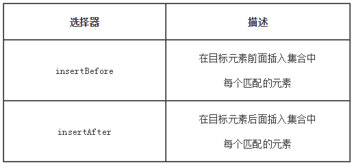

# jQuery的DOM操作

## 一、`DOM`的创建

### 1）创建节点和节点属性

**创建为属性节点**：

与创建元素节点同样的方式

```
$("<div id='test' class='aaron'>我是文本节点</div>")
```

## 二、`DOM`的插入

### 1）内部插入


> append()前面是被插入的对象，后面是要在对象内插入的元素内容 
>
> appendTo()前面是要插入的元素内容，而后面是被插入的对象


> .prepend()方法将指定元素插入到匹配元素里面作为它的第一个子元素 (如果要作为最后一个子元素插入用.append()).

### 2）外部插入




> - .before()和.insertBefore()实现同样的功能。主要的区别是语法——内容和目标的位置。 对于before()选择表达式在函数前面，内容作为参数，而.insertBefore()刚好相反，内容在方法前面，它将被放在参数里元素的前面
> - .after()和.insertAfter() 实现同样的功能。主要的不同是语法——特别是（插入）内容和目标的位置。 对于after()选择表达式在函数的前面，参数是将要插入的内容。对于 .insertAfter(), 刚好相反，内容在方法前面，它将被放在参数里元素的后面

## 三、`DOM`的删除

### 1）`empty()`

empty 顾名思义，清空方法，但是与删除又有点不一样，因为它只移除了 指定元素中的所有子节点。

这个方法不仅移除子元素（和其他后代元素），同样移除元素里的文本。

```html
<div class="hello"><p>慕课网</p></div>
```

如果我们通过empty方法移除里面div的所有元素，它只是清空内部的html代码，但是标记仍然留在DOM中

```js
//通过empty处理
$('.hello').empty()

//结果：<p>慕课网</p>被移除
<div class="hello"></div>
```

### 2）`remove()`的有参用法和无参用法

> remove与empty一样，都是移除元素的方法，但是remove会将元素自身移除，同时也会移除元素内部的一切，包括绑定的事件及与该元素相关的jQuery数据。

**remove表达式参数：**

remove比empty好用的地方就是可以传递一个选择器表达式用来过滤将被移除的匹配元素集合，可以选择性的删除指定的节点

我们可以通过$()选择一组相同的元素，然后通过remove（）传递筛选的规则，从而这样处理

对比右边的代码区域，我们可以通过类似于这样处理

```js
$("p").filter(":contains('3')").remove()
```

### 3）保留数据的删除操作`detach()`

如果我们希望临时删除页面上的节点，但是又不希望节点上的数据与事件丢失，并且能在下一个时间段让这个删除的节点显示到页面，这时候就可以使用`detach`方法来处理

`$("div").detach()`这一句会移除对象，仅仅是显示效果没有了。但是内存中还是存在的。当你append之后，又重新回到了文档流中。就又显示出来了。

```js
var p;
$("#bt1").click(function() {
    if (!$("p").length) return; //去重
    //通过detach方法删除元素
    //只是页面不可见，但是这个节点还是保存在内存中
    //数据与事件都不会丢失
    p = $("p").detach()
});

$("#bt2").click(function() {
    //把p元素在添加到页面中
    //事件还是存在
    $("body").append(p);
});
```
## 四、`DOM`的复制和替换

### 1）拷贝`clone()`

> `.clone()`方法深度 复制所有匹配的元素集合，包括所有匹配元素、匹配元素的下级元素、文字节点。

**如果节点有事件或者数据之类的其他处理**，我们需要通过clone(ture)传递一个布尔值ture用来指定，这样不仅仅只是克隆单纯的节点结构，还要把附带的事件与数据给一并克隆了

**eg.**

```js
HTML部分
<div></div>

JavaScript部分
$("div").on('click', function() {//执行操作})

//clone处理一
$("div").clone()   //只克隆了结构，事件丢失

//clone处理二
$("div").clone(true).css('color','red') //结构、事件与数据都克隆并改变css样式
```

### 2）替换`replaceWith()`和`replaceAll()`

**.replaceWith( newContent )**：用提供的内容替换集合中所有匹配的元素并且返回被删除元素的集合

```js
$("p:eq(1)").replaceWith('<a style="color:red">替换第二段的内容</a>')
```

> `.replaceAll()`和`.replaceWith()`功能类似，但是目标和源相反，用上述的HTML结构，我们用replaceAll处理

```js
$('<a style="color:red">替换第二段的内容</a>').replaceAll('p:eq(1)')
```

**注意：**

1. .replaceWith()与.replaceAll() 方法会删除与节点相关联的所有数据和事件处理程序

2. .replaceWith()方法，和大部分其他jQuery方法一样，返回jQuery对象，所以可以和其他方法链接使用
3. .replaceWith()方法返回的jQuery对象引用的是替换前的节点，而不是通过replaceWith/replaceAll方法替换后的节点

### 3）包裹和去除包裹

#### 4.3.1 `warp()`

如果要将元素用其他元素包裹起来，也就是给它增加一个父元素，针对这样的处理，JQuery提供了一个wrap方法

```js
$('p').wrap('<div></div>')
```

**.wrap( function )** **：**一个回调函数，返回用于包裹匹配元素的 HTML 内容或 jQuery 对象

```js
$('p').wrap(function() {
    return '<div></div>';   //与第一种类似，只是写法不一样
})
```

#### 4.3.2 `unwap()`

jQuery提供了一个unwrap()方法 ，作用与wrap方法是相反的。将匹配元素集合的父级元素删除，保留自身（和兄弟元素，如果存在）在原来的位置。

```js
<div>
    <p>p元素</p>
</div>
$('p').unwrap();
//结果
<p>p元素</p>
```

#### 4.3.3 `wrapAll()`

**.wrapAll( wrappingElement )**：给集合中匹配的元素增加一个外面包裹HTML结构

简单的看一段代码：

```js
<p>p元素</p>
<p>p元素</p>
```

给所有p元素增加一个div包裹

```js
$('p').wrapAll('<div></div>')
```

最后的结构，2个P元素都增加了一个父div的结构

```js
<div>
    <p>p元素</p>
    <p>p元素</p>
</div>
```

**.wrapAll( function )** **：**一个回调函数，返回用于包裹匹配元素的 HTML 内容或 jQuery 对象

#### 4.3.4 `wrapInner()`

**.wrapInner( wrappingElement )**：**给集合中匹配的元素的内部，增加包裹的HTML结构

```js
<div>p元素</div>
<div>p元素</div>
```

给所有元素增加一个p包裹

```js
$('div').wrapInner('<p></p>')
```

最后的结构，匹配的di元素的内部元素被p给包裹了

```js
<div>
    <p>p元素</p>
</div>
<div>
    <p>p元素</p>
</div>
```

**.wrapInner( function )** **：**允许我们用一个callback函数做参数，每次遇到匹配元素时，该函数被执行，返回一个DOM元素，jQuery对象，或者HTML片段，用来包住匹配元素的内容

## 五、`jQuery`的遍历

### 1）`children()`

.children(selector) 方法是返回匹配元素集合中每个元素的所有子元素（仅儿子辈，这里可以理解为就是父亲-儿子的关系）

```js
<div class="div">
    <ul class="son">
        <li class="grandson">1</li>
    </ul>
</div>
```

代码如果是`$("div").children()`，那么意味着只能找到`ul`，因为`div`与`ul`是父子关系，`li`与`div`是祖辈关系，因此无法找到。

```js
//找到所有class=div的元素
//找到其对应的子元素ul，然后筛选出最后一个，给边宽加上颜色
$('.div').children(':last').css('border', '3px solid blue')
```

### 2）`find()`

如果想快速查找DOM树中的这些元素的后代元素，此时可以用find()方法，注意 children与find方法的区别，**children是父子关系查找，find是后代关系（包含父子关系和祖辈关系）**

如上一个例子，代码如果是`$("div").find("li")`，此时，li与div是祖辈关系，通过find方法就可以快速的查找到了。

```js
//找到所有p元素，然后筛选出子元素是span标签的节点
//改变其字体颜色
var $spans = $('span');
$("p").find($spans).css('color', 'red');
```

### 3）`parent()`和`parents()`

`parent()`

如果想快速查找合集里面的每一个元素的**父**元素（这里可以理解为就是父亲-儿子的关系），此时可以用parent()方法

```js
//找到所有class=item-a的父元素
//然后给每个ul,然后筛选出最后一个，加上蓝色的边
$('.item-a').parent(':last').css('border', '1px solid blue')
```

`parents()`

如果想快速查找合集里面的每一个元素的所有**祖辈**元素，此时可以用parents()方法

parent只会查找一级，parents则会往上一直查到查找到祖先节点

### 4）`closest()`

查找当前元素的父辈祖辈元素，jQuery提供了closest()方法，这个方法类似parents但是又有一些细微的区别

从**元素本身**开始，在DOM 树上逐级向上级元素匹配，并**返回最先匹配的祖先元素**

### 5）`next()`和 `prev()`方法

#### 5.5.1 next()

如果想快速查找指定元素集合中每一个元素**紧邻的后面同辈元素**的元素**集合**

```js
//找到所有class=item-3的li
//然后筛选出第一个li，加上蓝色的边
$('.item-2').next(':first').css('border', '1px solid blue')
```

#### 5.5.2 prev()

如果想快速查找指定元素集合中每一个元素**紧邻的前面同辈元素**的元素**集合**

```js
//找到所有class=item-2的li
//然后筛选出最后一个，加上蓝色的边
$('.item-3').prev(':last').css('border', '1px solid blue')
```
### 6）`siblings()`

如果想快速查找指定元素集合中每一个元素的**同辈元素**，查找兄弟节点

```js
//找到class=item-2的所有兄弟节点
//然后筛选出最后一个，加上蓝色的边
$('.item-2').siblings(':last').css('border', '2px solid blue')
```

### 7）`add()`

jQuery为此提供add方法，用来创建一个新的jQuery对象 ，元素添加到匹配的元素集合中

> .add()的参数可以几乎接受任何的$()，包括一个jQuery选择器表达式，DOM元素，或HTML片段引用。

操作：选择所有的li元素，之后把p元素也加入到li的合集中

```
<ul>
    <li>list item 1</li>
    <li>list item 3</li>
</ul>
<p>新的p元素</p>
```

处理一：传递选择器

```
$('li').add('p')
```

处理二：传递dom元素

```
$('li').add(document.getElementsByTagName('p')[0])
```

还有一种方式，就是动态创建P标签加入到合集，然后插入到指定的位置，但是这样就改变元素的本身的排列了

```
 $('li').add('<p>新的p元素</p>').appendTo(目标位置)
```

### 8）`each()`

.each() 方法就是一个for循环的迭代器，它会迭代jQuery对象合集中的每一个DOM元素。每次回调函数执行时，会传递当前循环次数作为参数（从0开始计数）

> 1. each是一个for循环的包装迭代器 
> 2. each通过回调的方式处理，并且会有2个固定的实参，索引与元素 
> 3. each回调方法中的this指向当前迭代的dom元素

看一个简单的案例

```
<ul>
    <li>慕课网</li>
    <li>Aaron</li>
</ul>
```

开始迭代li，循环2次

```
$("li").each(function(index, element) {
     index 索引 0,1
     element是对应的li节点 li,li
     this 指向的是li
})
```

如果需要**提前退出**，可以以通过**返回 false**以便在回调函数内中止循