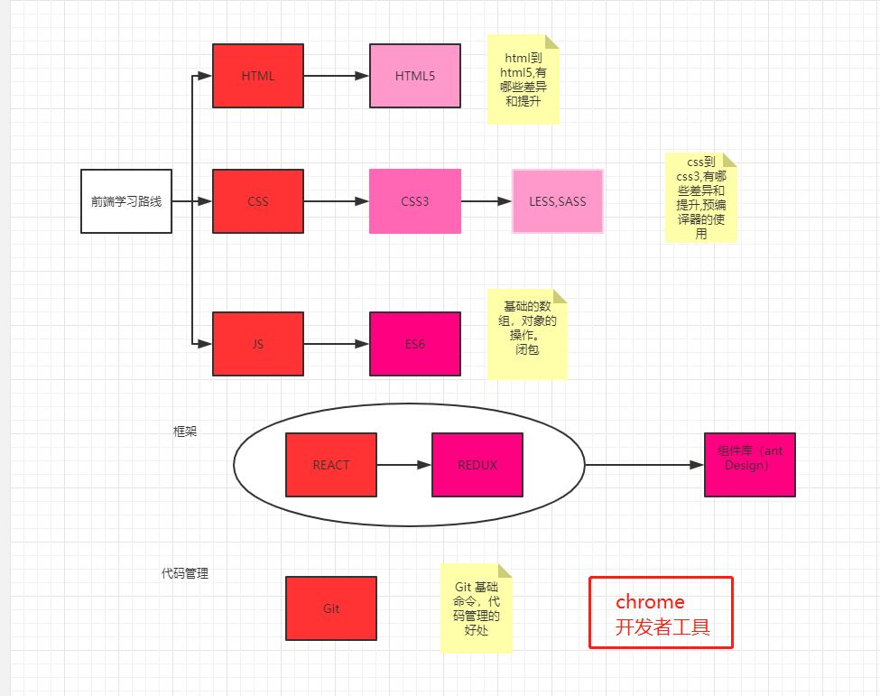

## CSS

### CSS 基础

#### CSS中的几个选择器

1. **id 选择器：**id是不能重复的 因此只能选择一个元素
2. **类选择器：**因为类名是可以重复使用的 因此 可以选择所有类名相同的元素
3. **属性选择器：**存在浏览器兼容性问题 ie6不支持
4. **派生选择器：**类似于a:hover p:first-letter这些是对某个元素的状态或者位置进行选择

> 其中 ID选择器 较 类选择器优先级高、响应快，主要应用于个体，经常用于JS方面的调用。

#### CSS的创建

1. 外部样式表

   ```html
   <head>
   <link rel="stylesheet" type="text/css" href="mystyle.css" />
   </head>
   ```

2. 内部样式表

   ```html
   <head>
   <style type="text/css">
     hr {color: sienna;}
     p {margin-left: 20px;}
     body {background-image: url("images/back40.gif");}
   </style>
   </head>
   ```

3. 内联样式

   ```
   <p style="color: sienna; margin-left: 20px">
   This is a paragraph
   </p>
   ```

在**多重样式**中 *内样式*  优先于 *外部样式*，内部没有的属性从外部继承。



