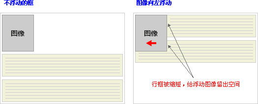
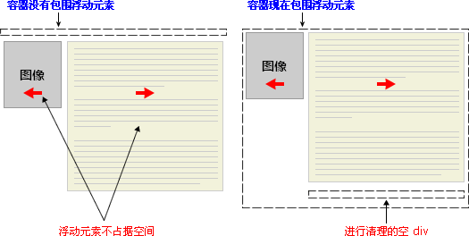

## CSS

### CSS 基础

#### CSS中的几个选择器

1. **id 选择器：**id是不能重复的 因此只能选择一个元素
2. **类选择器：**因为类名是可以重复使用的 因此 可以选择所有类名相同的元素
3. **属性选择器：**存在浏览器兼容性问题 ie6不支持
4. **派生选择器：**类似于a:hover p:first-letter这些是对某个元素的状态或者位置进行选择

> 其中 ID选择器 较 类选择器优先级高、响应快，主要应用于个体，经常用于JS方面的调用。

#### CSS的创建

1. 外部样式表

   ```html
   <head>
   <link rel="stylesheet" type="text/css" href="mystyle.css" />
   </head>
   ```

2. 内部样式表

   ```html
   <head>
   <style type="text/css">
     hr {color: sienna;}
     p {margin-left: 20px;}
     body {background-image: url("images/back40.gif");}
   </style>
   </head>
   ```

3. 内联样式

   ```html
   <p style="color: sienna; margin-left: 20px">
   This is a paragraph
   </p>
   ```

在**多重样式**中 *内样式*  优先于 *外部样式*，内部没有的属性从外部继承。

### CSS样式

#### 链接

链接的四种状态：

- a:link - 普通的、未被访问的链接
- a:visited - 用户已访问的链接
- a:hover - 鼠标指针位于链接的上方
- a:active - 链接被点击的时刻

当为链接的不同状态设置样式时，请按照以下次序规则：

- a:hover 必须位于 a:link 和 a:visited 之后
- a:active 必须位于 a:hover 之后

### CSS 盒模型

CSS 框模型 (Box Model) 规定了元素框处理**元素内容**、**内边距**、**边框** 和 **外边距** 的方式。


两者区别：IE盒子模型*（只在IE 6之前 ）*中，width 和 height 指的是内容区域+border+padding的宽度和高度，而标准盒子只包含了content。

### CSS 定位

> div、h1 或 p 元素常常被称为块级元素。这意味着这些元素显示为*一块内容*，即“块框”。与之相反，span 和 strong 等元素称为“行内元素”，这是因为它们的内容显示在行中，即“行内框”。

display 属性：

1. block，行内元素（比如 <a> 元素）表现得像块级元素一样，此元素前后会带有换行符（会独占一行，如果不设置宽度，其宽度会自动填满父元素的宽度，可以设置宽高，即使设置了宽度，小于父元素的宽度，块级元素也会独占一行）
2. none，让生成的元素根本没有框。这样的话，该框及其所有内容就不再显示，不占用文档中的空间。
3. inline，与block相反，将块元素，强制转换为行内元素（行内元素：元素会在一行内显示，超出屏幕宽度自动换行，不能设置宽度和高度，元素的宽度和高度只能是靠元素内的内容撑开）

**CSS 有三种基本的定位机制：普通流、浮动和绝对定位。**

#### CSS position 属性

1. static：元素框正常生成。块级元素生成一个矩形框，作为文档流的一部分，行内元素则会创建一个或多个行框，置于其父元素中。

2. relative：元素框偏移某个距离。元素仍保持其未定位前的形状，它**原本所占的空间仍保留**。

   > （相对定位：相对于普通流的位置）

3. absolute：元素框从文档流完全删除，并相对于其包含块定位。包含块可能是文档中的另一个元素或者是初始包含块。元素原先在正常文档流中所占的空间会关闭，就好像元素原来不存在一样。元素定位后生成一个块级框，而不论原来它在正常流中生成何种类型的框。

   > （绝对定位：**位置与文档流无关，因此不占据空间。**“相对于”最近的已定位祖先元素，如果不存在已定位的祖先元素，那么“相对于”最初的包含块。所以绝对定位可以覆盖其他元素：z-index 属性）

4. fixed：元素框的表现类似于将 position 设置为 absolute，不过其包含块是视窗本身。（固定定位）

#### css 浮动

浮动的框可以向左或向右移动，直到它的外边缘碰到包含框或另一个浮动框的边框为止。

##### float属性

- 行框和清理

浮动框旁边的行框被缩短，从而给浮动框留出空间，行框围绕浮动框。



要想阻止行框围绕浮动框，需要对该框应用 clear 属性。clear 属性的值可以是 left、right、both 或 none，它表示框的哪些边不应该挨着浮动框。


假设希望让一个图片浮动到文本块的左边，并且希望这幅图片和文本包含在另一个具有背景颜色和边框的元素中

```html
.news {
  background-color: gray;
  border: solid 1px black;
  }

.news img {
  float: left;
  }

.news p {
  float: right;
  }

<div class="news">

<p>some text</p>
</div>
```

因为**浮动元素脱离了文档流**，所以包围图片和文本的 div 不占据空间。如何让包围元素在视觉上包围浮动元素呢？需要在这个元素中的某个地方应用 **clear**：



由于没有现有的元素可以应用清理，所以我们只能添加一个空元素并且清理它。

```html
.news {
  background-color: gray;
  border: solid 1px black;
  }

.news img {
  float: left;
  }

.news p {
  float: right;
  }

.clear {
  clear: both;
  }

<div class="news">

<p>some text</p>
<div class="clear"></div>
</div>
```

还有另一种办法，那就是对容器 div 进行浮动：

```html
.news {
  background-color: gray;
  border: solid 1px black;
  float: left;
  }

.news img {
  float: left;
  }

.news p {
  float: right;
  }

<div class="news">

<p>some text</p>
</div>
```

> 不幸的是，下一个元素会受到这个浮动元素的影响。为了解决这个问题，有些人选择对布局中的所有东西进行浮动，然后使用适当的有意义的元素（常常是站点的页脚）对这些浮动进行清理。这有助于减少或消除不必要的标记。

**clear**：定义了元素的哪边上不允许出现浮动元素