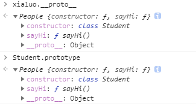
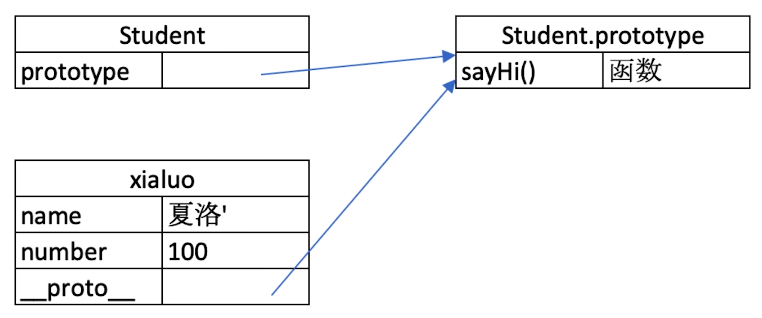
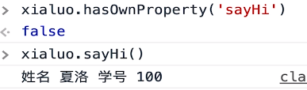
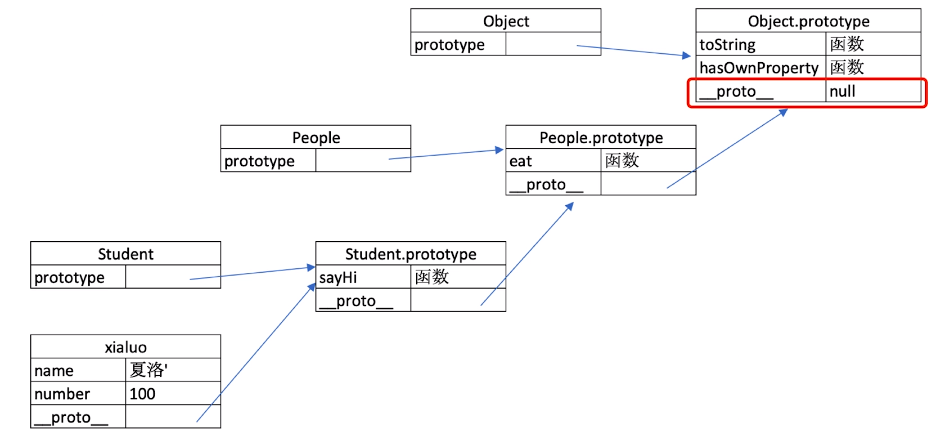

## class和继承

1. class

   - constructor
   - 属性
   - 方法

   然后通过 `new`或者字面量 来创建一个实例

2. 继承

   - extends 
   - super （执行父类的构造函数）
   - 扩展或重写

## 原型

1. 每个实例都有隐式原型：`实例名.__proto__`

2. 每个class都有显式原型：`函数名.prototype`

> 隐式原型 === 显式原型，一个地址

3. 实例的隐式原型指向Class的显示原型：

   `xialuo.__proto__`  =>  `Student.prototype`

- 基于原型的执行方法：
  1. 获取属性xialuo.name或执行方法 xialuo.sayhi()时
  2. 现在自身属性和方法寻找
  3. 找不到则自动去隐式原型中查找

## 原型链

实现都是JS的V8引擎，ECMA只是一个书写规范

### 继承的原理

同样，`People.prototype ===  Student.prototype.__proto__` 就为true。

而hasOwnProperty来自People的隐式原型（指向Object的显示原型）

那这就是原型链

### instanceof原理

就是根据原型链向上查找，例如用 `instanceof` 判断是不是Object，就一直往上找，看是否是Object的隐式原型

### Class的原型本质

- 原型和原型链的图示
- 属性和方法的执行规则