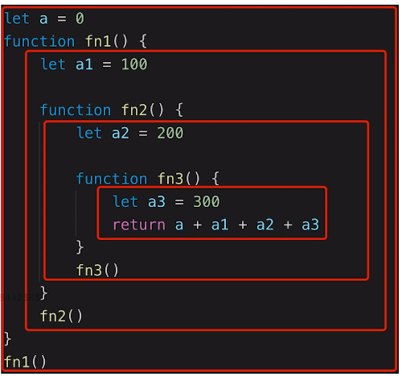
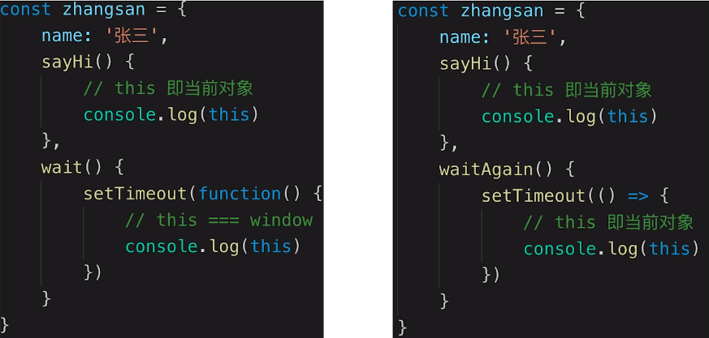
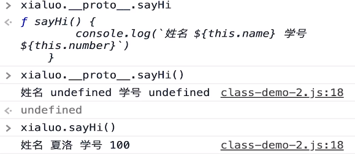

## 作用域和自由变量

1. 作用域：变量合法的使用范围

   - 全局作用域
   - 函数作用域
   - 块级作用域（ES6）例如 if、for之类

   

2. 自由变量
   - 一个变量在当前作用域没有定义，但使用了
   - 向上级作用域，一层层的依次寻找，找到为止
   - 如果到全局作用域都没有找到，报错 xx is not defined

## 闭包

闭包是作用域应用的特殊情况，有两种表现：

- 函数作为参数传入（类似`JQuery`的`each`）
- 函数作为返回值被返回（类似`redux-thunk`的`dispatch(action)`）

```js
// 函数作为返回值
function create() {
  const a = 100
  return function () {
      console.log(a)
  }
}

const fn = create()
const a = 200
fn() // 100

// 函数作为参数被传递
function print(fn) {
  const a = 200
  fn()
}
const a = 100
function fn() {
  console.log(a)
}
print(fn) // 100
```

> **注意：**所有的自由变量的查找，是在定义的地方，向上级作用域查找，不是在执行的地方！！！

## this

- 作为普通函数被调用
- 使用call、apply、bind被调用
- 作为对象方法被调用
- 在class方法中调用
- 箭头函数

> **注意：**this指向取什么值，是在函数执行的时候确认的

```js
function fn1() {
  console.log(this)
}
fn1() //window

fun1.call({x: 100}) //{x: 100}

const fn2 = fn1.bind({x: 200})
fn2() // {x: 200} bind是返回一个新的函数来执行
```



`setTimeout` 里的 `function` 不是对象调用的，它是由 `setTimeout` 触发的，情况和第一种类似

> **注意**：箭头函数本身没有this，它的this取上级非箭头函数作用域的this

```js
class People {
  constructor(name) {
      this.name = name //this代表正在创建的这个实例
  }
  eat() {
      console.log(this) //同样是这个实例（例如张三对象）
  }
}
```

### 原型中的this



原因：`xialuo.satHi()` 其实 **类似** 于 `xialuo.__proto__.sayHi.call(xialuo)`

`xiaoluo.__proto__.name` 以及 `xiaoluo.__proto__.number` 是 `undefined` 的