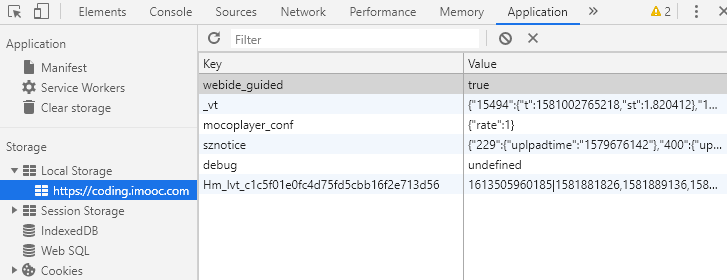

## cookie

- 本身用于浏览器和server通讯

- 被借用到本地存储来
- 可用document.cookie = ‘...’ 来修改

**缺点：**

- 存储大小，最大4KB
- http请求时需要发送到服务端，增加了请求据量
- API 易用性问题

## HTML5存储

### localStorage和sessionStorage

- HTML5 专门为存储而设计，最大可存5M
- API 简单易用：setItem 和 getItem
- 不会随着http的请求发送出去

> 根据Key值对应数据

#### localStorage和sessionStorage的区别

1. localStorage 数据会永久存储，除非代码或手动删除
2. sessionStorage 数据只存在当前会话（当前和服务端的连接），浏览器关闭则清空
3. localStorage 会用的多些