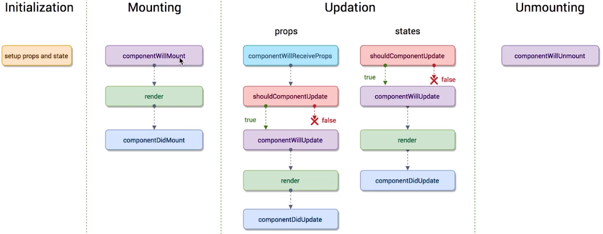
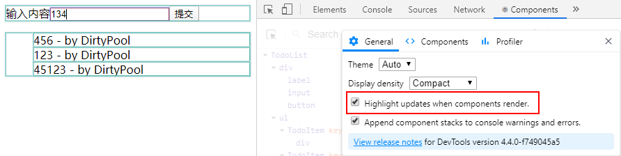
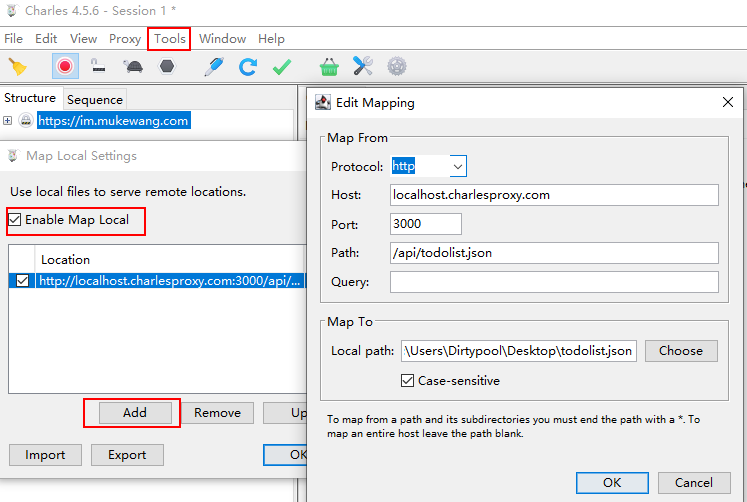

## PropTypes和DefaultProps的应用

1. PropTypes是用于强校验的，限制父组件的传值类型：

   ```jsx
   import PropTypes from 'prop-types'
   TodoItem.propTypes = {
     //isRequired指必须要传递
     test: PropTypes.string.isRequired,
     // 一个对象可以是几种类型中的任意一个类型
     content: PropTypes.oneOfType([
       PropTypes.string,
       PropTypes.number
     ]),
     deleteItem: PropTypes.func.isRequired,
     index: PropTypes.number
   }
   ```

2. DefaultProps用于设置默认属性

   ```jsx
   TodoItem.defaultProps = {
     test: 'hello'
   }
   ```

PropTypes更多方法在：[React官方文档](https://react.docschina.org/docs/typechecking-with-proptypes.html)

## Props, State与render函数的关系

当组件的Props, State发生变化是render函数会重新执行，当父组件的render函数被运行时，子组件的render也会被重新执行一次。

## 虚拟DOM

1. state/props 数据

2. JSX 模版

3. 数据 + 模版 生成虚拟DOM

   ==虚拟DOM就是一个JS对象，用它来描述真实DOM== （生成对象比生成DOM损耗新能低很多）

   ```jsx
   React.createElement('div',{id:'abc'},React.createElement.('span',{},'hello'))
   ```

4. 用虚拟DOM的结构生成真实的DOM来显示

   ```html
   <div id='abc'><span>hello</span></div>
   ```

5. state/props 发生变化

6. 数据 + 模版 生成新的虚拟DOM

   ```jsx
   ['div',{id:'abc'},['span',{},'bye']]
   ```

7. 比较原始虚拟DOM和新的虚拟DOM的区别

8. 直接操作DOM，改变相应的内容 

> JSX -> createElement -> JS 对象（虚拟DOM）-> 真实DOM

优点：

1. 性能提升
2. 使得跨端应用得以实现，React Native。通过虚拟DOM来生成原生组件

### Diff算法

setState是异步的，原因：连续调用setState，React会合并连续的多次调用，只调用一次，来提升性能。

1. 同层比对：算法简单，但可能浪费生成虚拟的DOM时间（第一层不同，直接删除原始的虚拟DOM，生成新的）
2. Key值：每个DOM节点有Key值，作比对时快速建立起关联，==Key值不要是index，不能保证新DOM节点和旧DOM节点的Key值保持一致== 

## ref 的使用

ref是一种引用，帮助直接获取DOM元素。

下面是几个适合使用 refs 的情况：

- 管理焦点，文本选择或媒体播放。
- 触发强制动画。
- 集成第三方 DOM 库。

使用方法：（这种情况不建议使用）

```jsx
<input
	ref={(inputText) => {this.input = inputText}}
  onChange={this.handleInputChange}
/>
handleInputChange() {
  const value = this.input.value;
  this.setState(() => ({
    inputValue: value
  }), () => {
    console.log(this.input.value);
  });
}
```

当ref和setState结合时，DOM获取不及时，原因是setState是异步的，可以用==setState的第二个属性，是一个回调函数，setState执行完后才执行==

## React的生命周期函数（钩子函数）

==生命周期函数指在某一时刻会自动调用执行的函数，是针对每一个组件来讲==，类似render()函数



**render函数会被反复执行**

**初始化：**

1. **初始化state和props**

**挂载：**

1. **componentWillMount：**

   在组件即将被挂载到页面的时刻自动执行

2. **render**：

   组件渲染

3. **componentDidMount：**

   > `componentDidMount`和`componentWillMount`这两个函数，只在挂载时执行（第一次在页面显示时）

**更新：**

1. componentWillReceiveProps：==**（已被废弃）**==

   当组件从父组件接受参数，只要父组件的render函数被==重新==执行了就会执行该生命周期函数（如果这个组件第一次存在于父组件中，不会执行，如果之前已经存在于父组件中，才会执行）

2. **shouldComponentUpdate：**

   组件更新之前执行，返回布尔值

3. componentWillUpdate：==**（已被废弃）**==

   组件被更新之前，shouComponentUpdate之后，取决于shouComponentUpdate返回的布尔值来判断是否执行

4. **render**：

   组件更新，重新渲染

5. **componentDidUpdate**

   组件更新完成后执行

**卸载**：

1. **componentWillUnmount**：

   组件即将被从页面中剔除的时候执行

### 使用场景

当父组件的render执行时，子组件的render也会被执行，这样会带来性能损耗。

eg.



打开React Developer Tools开启Highlight后，发现在父组件的输入框中输入数据，并没有改变子组件item的值，但是子组件item的render也被更新了

此时，就可以用到`shouldComponentUpdate()`这个生命周期函数：

eg. 在子组件中：

```jsx
shouldComponentUpdate(nextProps,nextState) {
  if(nextProps.content !== this.props.content){
    return true;
  }else{
    return false;
  }
}
```

eg. ==发送AJAX请求，放在componentDidMount()中==：

由于React中不像JQuery一样有封装AJAX，所以使用axios

```shell
npm install axios
```

完成后

```jsx
import axios from 'axios'
componentDidMount(){
  axios.get('/api/todolist')
    .then(() => {alert('success')})
  	.catch(() => {alert('error')})
}
```

## 使用Charles实现本地数据mock

```jsx
import axios from 'axios'
componentDidMount(){
  axios.get('http://localhost.charlesproxy.com:3000/api/todolist.json')
    .then((res) => {
    	this.setState(() => ({
        list: [...res.data]
    }));
  })
    .catch(() => {alert('error')})
}
```

新建json文件todolist

```json
["dell","lee"]
```

在Charles中



在浏览器中输入http://localhost.charlesproxy.com:3000

