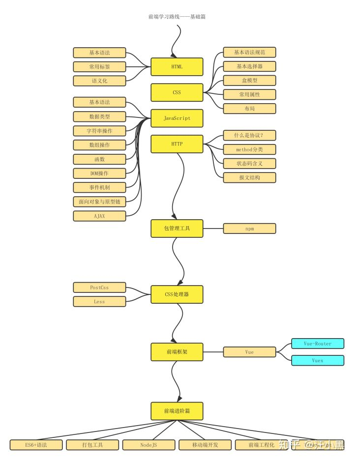
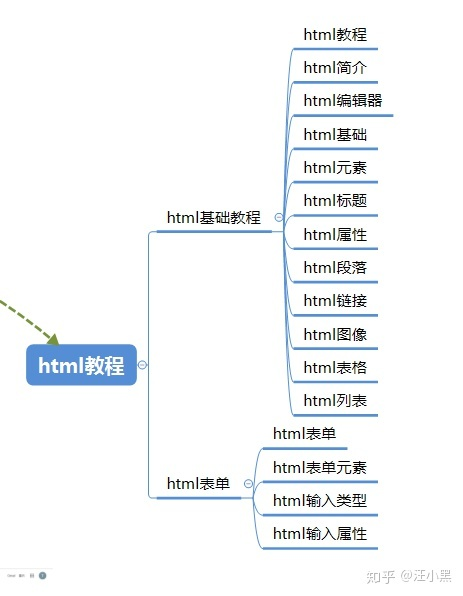
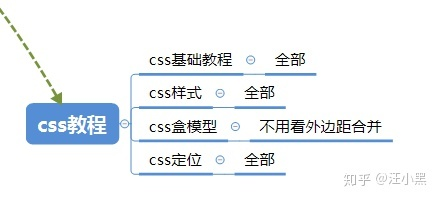
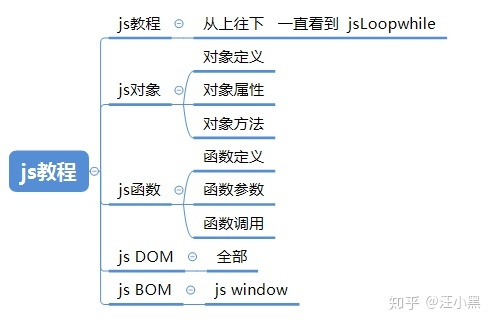

## 自学WEB前端细致路线

### 基础大纲

### 细节大纲

#### HTML

带着这几个问题去看教程：

1. html是什么
2. html的基本结构长什么样子
3. 标签是什么
4. 属性是什么

#### CSS

带着这几个问题去看w3cshcool的教程：

1. css是什么
2. css的语法是怎么样的结构
3. 怎么对一个标签增加简单的样式，自己尝试一下
4. css盒模型是什么
5. display和position的值有哪几种，这几种值区别是什么
6. css怎么实现垂直水平居中？你能使用几种方式实现？
7. 页面的常见布局有那几种，分别可以怎么实现？

#### JavaScript

#### Promise

1. promise是什么，它为了解决什么问题？ 
2. fetch是什么，为了解决什么问题？ 
3. fetch和promise有什么关系？ 
4. fetch和ajax有什么关系？