# 二、网络基础

## (1) 通用知识

### 1.1 状态码

- 101 切换请求协议
- 200 请求成功
- 301 永久性重定向，会缓存
- 302 临时重定向，不会缓存
- 304 资源未修改
- 400 客户端请求的语法错误
- 403 服务器禁止，权限有关
- 404 服务器无法根据客户端的请求找到资源
- 500 服务端错误

### 1.2 端口及服务

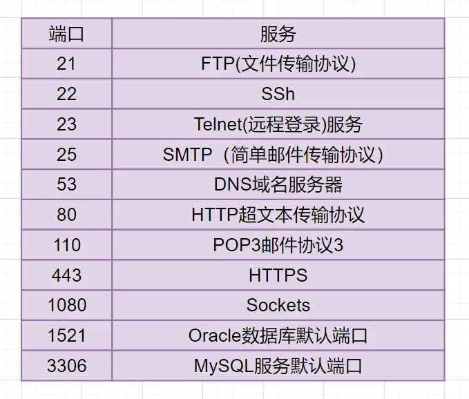

### 1.3 端口及对应服务


### 1.4 计算机网络体系架构

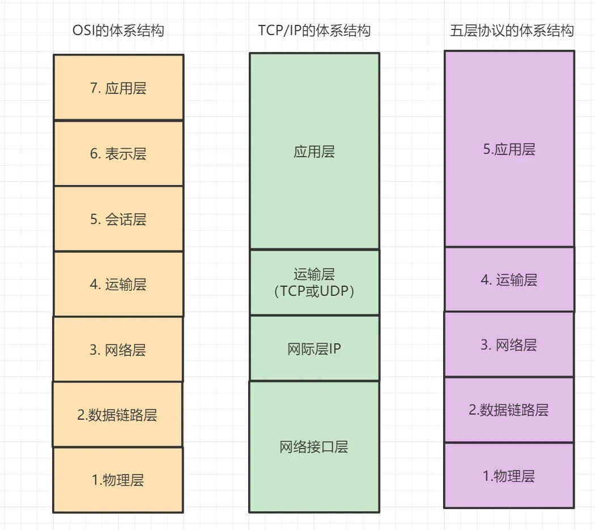

#### 1.4.1 ISO 七层模型

- 应用层：网络服务与最终用户的一个接口，常见的协议有：**HTTP FTP  SMTP SNMP DNS**.
- 表示层：数据的表示、安全、压缩。，确保一个系统的应用层所发送的信息可以被另一个系统的应用层读取。
- 会话层：建立、管理、终止会话,对应主机进程，指本地主机与远程主机正在进行的会话.
- 传输层：定义传输数据的协议端口号，以及流控和差错校验,协议有**TCP UDP**.
- 网络层：进行逻辑地址寻址，实现不同网络之间的路径选择,协议有**ICMP IGMP IP等**.
- 数据链路层：在物理层提供比特流服务的基础上，建立相邻结点之间的数据链路。
- 物理层：建立、维护、断开物理连接。

#### 1.4.2 TCP/IP 四层模型

- 应用层：对应于OSI参考模型的（应用层、表示层、会话层）。
- 传输层: 对应OSI的传输层，为应用层实体提供端到端的通信功能，保证了数据包的顺序传送及数据的完整性。
- 网际层：对应于OSI参考模型的网络层，主要解决主机到主机的通信问题。
- 网络接口层：与OSI参考模型的数据链路层、物理层对应。

#### 1.4.3 五层体系结构

- 应用层：对应于OSI参考模型的（应用层、表示层、会话层）。
- 传输层：对应OSI参考模型的的传输层
- 网络层：对应OSI参考模型的的网络层
- 数据链路层：对应OSI参考模型的的数据链路层
- 物理层：对应OSI参考模型的的物理层。

### 1.5 HTTP

#### 1.5.1 无状态

服务器不会记住发送请求的客户端是谁（加cookie解决）

#### 1.5.2 HTTP/1.0，1.1，2.0 区别

> **HTTP/1.0**默认是短连接，可以强制开启，**HTTP/1.1**默认长连接，HTTP/2.0采用多路复用
>
> HTTP分为长连接和短连接，**本质上说的是TCP的长短连接**。
>
> - TCP 的**keep-alive**包含三个参数，支持在系统内核的net.ipv4里面设置；当 TCP 连接之后，闲置了**tcp_keepalive_time**，则会发生侦测包，如果没有收到对方的ACK，那么会每隔 tcp_keepalive_intvl再发一次，直到发送了**tcp_keepalive_probes**，就会丢弃该连接。

1. `HTTP/1.0`

- 默认是短连接，每次请求都需要建立一个TCP连接。
- 它可以设置`Connection: keep-alive` 这个字段，强制开启长连接

2. `HTTP/1.1`

- 引入了持久连接，即TCP连接默认不关闭，可以被多个请求复用
- 分块传输编码，即服务端每产生一块数据，就发送一块，用”流模式”取代”缓存模式”
- 管道机制，即在同一个TCP连接里面，客户端可以同时发送多个请求

3. `HTTP/2.0`

- **二进制协议**，1.1版本的头信息是文本（ASCII编码），数据体可以是文本或者二进制；2.0中，头信息和数据体都是二进制
- 完全多路复用，在一个连接里，客户端和浏览器都可以同时发送多个请求或回应，而且不用按照顺序一一对应
- **报头压缩**，HTTP协议不带有状态，每次请求都必须附上所有信息。Http/2.0引入了头信息压缩机制，使用gzip或compress压缩后再发送
- **服务端推送**，允许服务器未经请求，主动向客户端发送资源

#### 1.5.3 POST 和 GET 区别

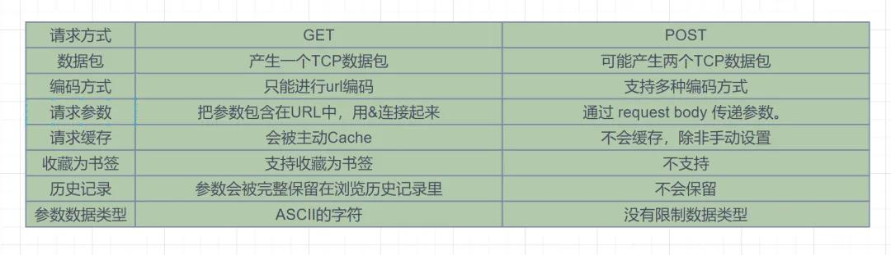

#### 1.5.4 HTTP 与 HTTPS 区别

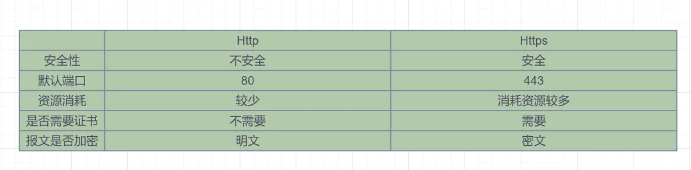

##### 1.5.4.1 HTTPS 流程

1. 客户端发起Https请求，连接到服务器的443端口。
2. 服务器必须要有一套数字证书（证书内容有公钥、证书颁发机构、失效日期等）。
3. 服务器将自己的数字证书发送给客户端（公钥在证书里面，私钥由服务器持有）。
4. 客户端收到数字证书之后，会验证证书的合法性。如果证书验证通过，就会生成一个随机的对称密钥，用证书的公钥加密。
5. 客户端将公钥加密后的密钥发送到服务器。
6. 服务器接收到客户端发来的密文密钥之后，用自己之前保留的私钥对其进行非对称解密，解密之后就得到客户端的密钥，然后用客户端密钥对返回数据进行对称加密，酱紫传输的数据都是密文啦。
7. 服务器将加密后的密文返回到客户端。
8. 客户端收到后，用自己的密钥对其进行对称解密，得到服务器返回的数据。

#### 1.5.5 TCP 三次握手

1. 第一次握手(SYN=1, seq=x)，发送完毕后，客户端就进入SYN_SEND状态

2. 第二次握手(SYN=1, ACK=1, seq=y, ACKnum=x+1)， 发送完毕后，服务器端就进入SYN_RCV状态。

3. 第三次握手(ACK=1，ACKnum=y+1)，发送完毕后，客户端进入ESTABLISHED状态，当服务器端接收到这个包时，也进入ESTABLISHED状态。

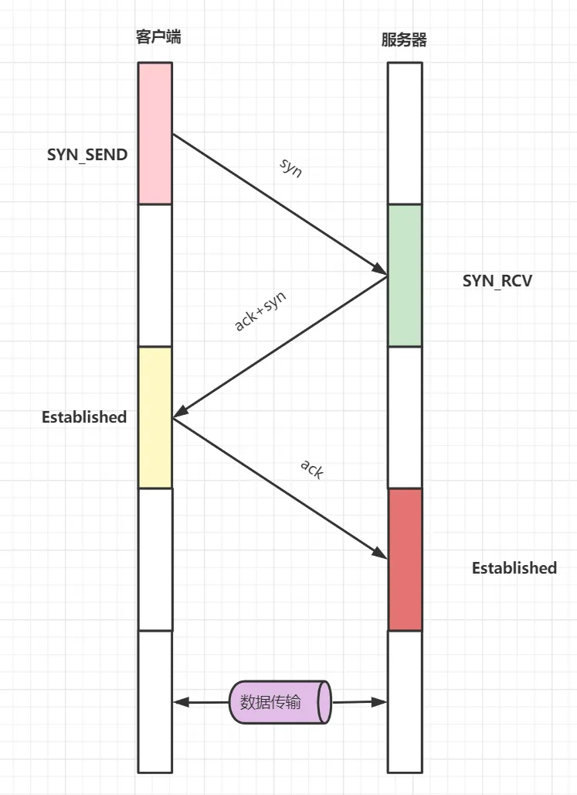

#### 1.5.6 TCP 四次挥手

1. 第一次挥手(FIN=1，seq=u)，发送完毕后，客户端进入**FIN_WAIT_1**状态。
2. 第二次挥手(ACK=1，ack=u+1,seq =v)，发送完毕后，服务器端进入**CLOSE_WAIT**状态，客户端接收到这个确认包之后，进入**FIN_WAIT_2**状态。
3. 第三次挥手(FIN=1，ACK1,seq=w,ack=u+1)，发送完毕后，服务器端进入**LAST_ACK**状态，等待来自客户端的最后一个ACK。
4. 第四次挥手(ACK=1，seq=u+1,ack=w+1)，客户端接收到来自服务器端的关闭请求，发送一个确认包，并进入TIME_WAIT状态，**等待了某个固定时间（两个最大段生命周期，2MSL，2 Maximum Segment Lifetime）之后**，没有收到服务器端的ACK ，认为服务器端已经正常关闭连接，于是自己也关闭连接，进入CLOSED状态。服务器端接收到这个确认包之后，关闭连接，进入CLOSED状态。

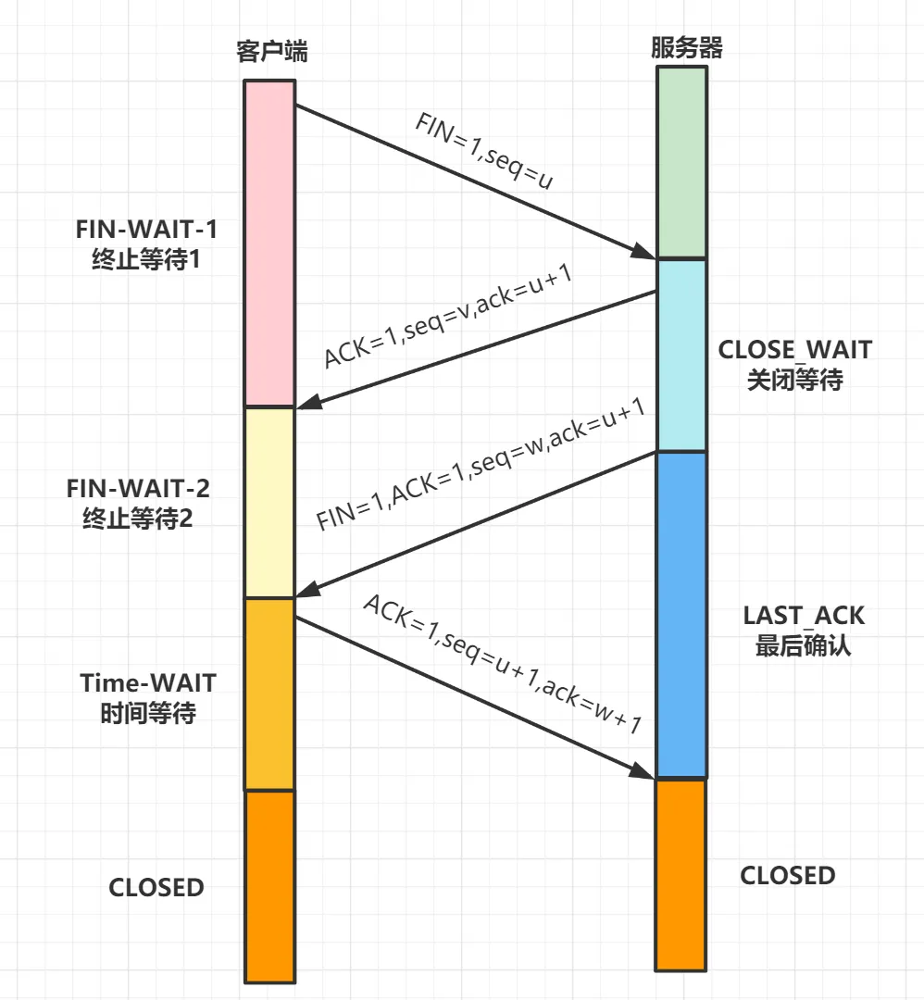

#### 1.5.7 TCP 的粘包和拆包

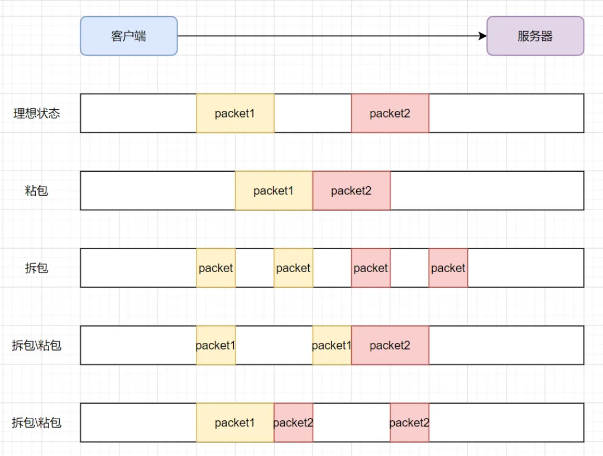

**解决方案：**

- 发送端将每个数据包封装为固定长度
- 在数据尾部增加特殊字符进行分割
- 将数据分为两部分，一部分是头部，一部分是内容体；其中头部结构大小固定，且有一个字段声明内容体的大小。

#### 1.5.8 TCP 的流量控制

TCP 三次握手，发送端和接收端进入到`ESTABLISHED`状态，它们即可以愉快地传输数据啦。

但是发送端不能疯狂地向接收端发送数据，因为接收端接收不过来的话，接收方只能把处理不过来的数据存在缓存区里。如果缓存区都满了，发送方还在疯狂发送数据的话，接收方只能把收到的数据包丢掉，这就浪费了网络资源。

> 使用 滑动窗口解决，TCP 报文首部有个字段win控制窗口大小，它告诉对方本端的TCP接收缓冲区还能容纳多少字节的数据，这样对方就可以控制发送数据的速度，从而达到**流量控制**的目的。

#### 1.5.9 TCP 和 UDP 的区别

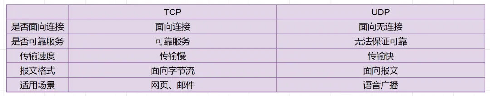

#### 1.5.10 TCP 报文首部字段及其作用

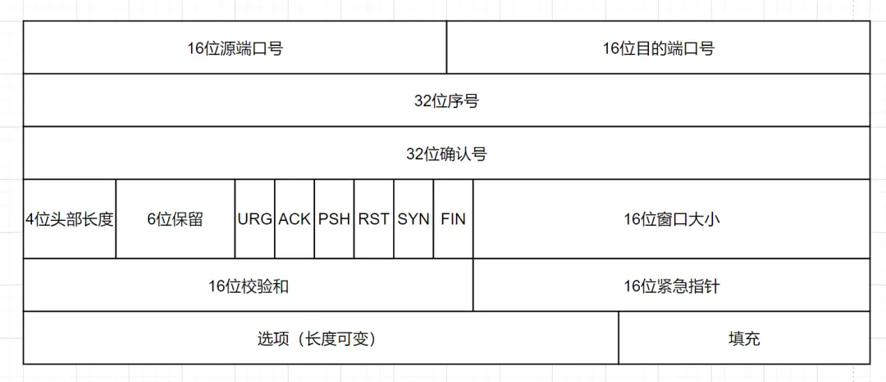

- **16位端口号**：源端口号，主机该报文段是来自哪里；目标端口号，要传给哪个上层协议或应用程序
- **32位序号**：一次TCP通信（从TCP连接建立到断开）过程中某一个传输方向上的字节流的每个字节的编号。
- **32位确认号**：用作对另一方发送的tcp报文段的响应。其值是收到的TCP报文段的序号值加1。
- **4位头部长度**：表示tcp头部有多少个32bit字（4字节）。因为4位最大能标识15，所以TCP头部最长是60字节。
- **6位标志位**：URG(紧急指针是否有效)，ACk（表示确认号是否有效），PSH（缓冲区尚未填满），RST（表示要求对方重新建立连接），SYN（建立连接消息标志接），FIN（表示告知对方本端要关闭连接了）
- **16位窗口大小**：是TCP流量控制的一个手段。这里说的窗口，指的是接收通告窗口。它告诉对方本端的TCP接收缓冲区还能容纳多少字节的数据，这样对方就可以控制发送数据的速度。
- **16位校验和**：由发送端填充，接收端对TCP报文段执行CRC算法以检验TCP报文段在传输过程中是否损坏。注意，这个校验不仅包括TCP头部，也包括数据部分。这也是TCP可靠传输的一个重要保障。
- **16位紧急指针**：一个正的偏移量。它和序号字段的值相加表示最后一个紧急数据的下一字节的序号。因此，确切地说，这个字段是紧急指针相对当前序号的偏移，不妨称之为紧急偏移。TCP的紧急指针是发送端向接收端发送紧急数据的方法。

#### 1.5.11 TCP 的重传机制

- 超时重传：RTT就是数据完全发送完，到收到确认信号的时间，即数据包的一次往返时间。超时重传时间，就是RTO，对于TCP，如果发生一次超时重传，时间间隔下次就会加倍

- 快速重传：不以时间驱动，而是以数据驱动，基于接收端的反馈信息来引发重传，ACK只向告知发送方，最大的有序报文段。到底是哪个报文丢失了呢？**并不确定**
- 带选择确认的重传（SACK）、重复SACK ，这俩知道该重传哪些数据包

### 1.6 WebSocket与socket的区别

- Socket其实就是等于**IP地址 + 端口 + 协议**。
- WebSocket是一个持久化的协议，它是伴随H5而出的协议，用来解决**http不支持持久化连接**的问题。
- Socket一个是**网编编程的标准接口**，而WebSocket则是应用层通信协议。

### 1.7  从浏览器地址栏输入url到显示主页的过程

1. DNS解析，查找域名对应的IP地址。
2. 与服务器通过三次握手，建立TCP连接
3. 向服务器发送HTTP请求
4. 服务器处理请求，返回网页内容
5. 浏览器解析并渲染页面
6. TCP四次挥手，连接结束

### 1.8 Session 和 Cookie 的区别

- Cookie是保存在客户端的一小块文本串的数据。客户端向服务器发起请求时，服务端会向客户端发送一个Cookie，客户端就把Cookie保存起来。在客户端下次向同一服务器再发起请求时，Cookie被携带发送到服务器。服务器就是根据这个Cookie来确认身份的。
- session指的就是服务器和客户端一次会话的过程。Session利用Cookie进行信息处理的，当用户首先进行了请求后，服务端就在用户浏览器上创建了一个Cookie，当这个Session结束时，其实就是意味着这个Cookie就过期了。Session对象存储着特定用户会话所需的属性及配置信息。

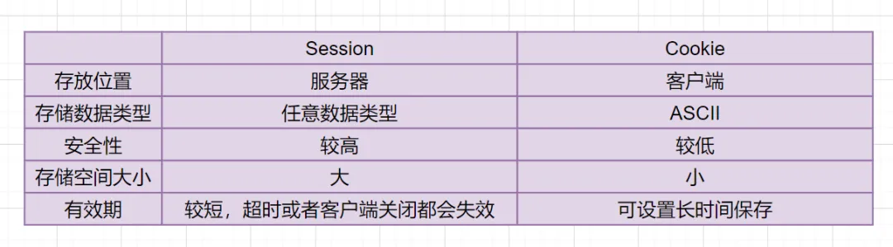

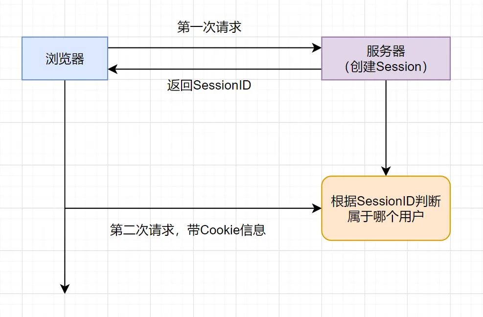

## (2) WebSocket

HTML5开始提供的一种浏览器与服务器进行全双工通讯的网络技术，属于应用层协议。它基于TCP传输协议，并复用HTTP的握手通道。支持==双向通信==，更灵活，更高效，可扩展性更好

### 2.1 基础常识

以 8080 端口为通讯端口，有以下优点：

1. 支持双向通信，实时性更强。
2. 更好的二进制支持。
3. 较少的控制开销。连接创建后，ws客户端、服务端进行数据交换时，协议控制的数据包头部较小。在不包含头部的情况下，服务端到客户端的包头只有2~10字节（取决于数据包长度），客户端到服务端的的话，需要加上额外的4字节的掩码。而HTTP协议每次通信都需要携带完整的头部。
4. 支持扩展。ws协议定义了扩展，用户可以扩展协议，或者实现自定义的子协议。（比如支持自定义压缩算法等）

### 2.2 如何建立连接

#### 2.2.1 客户端：申请协议升级

```http
GET / HTTP/1.1
Host: localhost:8080
Origin: http://127.0.0.1:3000
Connection: Upgrade
Upgrade: websocket
Sec-WebSocket-Version: 13
Sec-WebSocket-Key: w4v7O6xFTi36lq3RNcgctw==
```

- `Connection: Upgrade`：表示要升级协议
- `Upgrade: websocket`：表示要升级到websocket协议。
- `Sec-WebSocket-Version: 13`：表示websocket的版本。如果服务端不支持该版本，需要返回一个`Sec-WebSocket-Version`header，里面包含服务端支持的版本号。
- `Sec-WebSocket-Key`：与后面服务端响应首部的`Sec-WebSocket-Accept`是配套的，提供基本的防护，比如恶意的连接，或者无意的连接。

#### 2.2.2 服务端：响应协议升级

```http
HTTP/1.1 101 Switching Protocols
Connection:Upgrade
Upgrade: websocket
Sec-WebSocket-Accept: Oy4NRAQ13jhfONC7bP8dTKb4PTU=
```

状态代码`101`表示协议切换。到此完成协议升级，后续的数据交互都按照新的协议来

#### 2.2.3 `Sec-WebSocket-Accept` 的计算

`Sec-WebSocket-Accept`根据客户端请求首部的`Sec-WebSocket-Key`计算出来。

计算公式为：

1. 将`Sec-WebSocket-Key`跟`258EAFA5-E914-47DA-95CA-C5AB0DC85B11`拼接。
2. 通过`SHA1`计算出摘要，并转成`base64`字符串。

#### 2.2.4 数据帧格式

`WebSocket`客户端、服务端通信的最小单位是帧（frame），由1个或多个帧组成一条完整的消息（message）。

1. 发送端：将消息切割成多个帧，并发送给服务端；
2. 接收端：接收消息帧，并将关联的帧重新组装成完整的消息；

```cobol
  0                   1                   2                   3
  0 1 2 3 4 5 6 7 8 9 0 1 2 3 4 5 6 7 8 9 0 1 2 3 4 5 6 7 8 9 0 1
 +-+-+-+-+-------+-+-------------+-------------------------------+
 |F|R|R|R| opcode|M| Payload len |    Extended payload length    |
 |I|S|S|S|  (4)  |A|     (7)     |             (16/64)           |
 |N|V|V|V|       |S|             |   (if payload len==126/127)   |
 | |1|2|3|       |K|             |                               |
 +-+-+-+-+-------+-+-------------+ - - - - - - - - - - - - - - - +
 |     Extended payload length continued, if payload len == 127  |
 + - - - - - - - - - - - - - - - +-------------------------------+
 |                               |Masking-key, if MASK set to 1  |
 +-------------------------------+-------------------------------+
 | Masking-key (continued)       |          Payload Data         |
 +-------------------------------- - - - - - - - - - - - - - - - +
 :                     Payload Data continued ...                :
 + - - - - - - - - - - - - - - - - - - - - - - - - - - - - - - - +
 |                     Payload Data continued ...                |
 +---------------------------------------------------------------+
```

- 从左到右，单位是比特。比如`FIN`、`RSV1`各占据1比特，`opcode`占据4比特。

- 内容包括了标识、操作代码、掩码、数据、数据长度等。

**Opcode**: 4个比特。

操作代码，Opcode的值决定了应该如何解析后续的数据载荷（data payload）。如果操作代码是不认识的，那么接收端应该断开连接（fail the connection）。可选的操作代码如下：

- %x0：表示一个延续帧。当Opcode为0时，表示本次数据传输采用了数据分片，当前收到的数据帧为其中一个数据分片。
- %x1：表示这是一个文本帧（frame）
- %x2：表示这是一个二进制帧（frame）
- %x3-7：保留的操作代码，用于后续定义的非控制帧。
- %x8：表示连接断开。
- %x9：表示这是一个ping操作。
- %xA：表示这是一个pong操作。
- %xB-F：保留的操作代码，用于后续定义的控制帧。

#### 2.2.5 数据传递

WebSocket根据`opcode`来区分操作的类型。比如`0x8`表示断开连接，`0x0`-`0x2`表示数据交互。

#### 1、数据分片

WebSocket的每条消息可能被切分成多个数据帧。当WebSocket的接收方收到一个数据帧时，会根据`FIN`的值来判断，是否已经收到消息的最后一个数据帧。

FIN=1表示当前数据帧为消息的最后一个数据帧，此时接收方已经收到完整的消息，可以对消息进行处理。FIN=0，则接收方还需要继续监听接收其余的数据帧。

此外，`opcode`在数据交换的场景下，表示的是数据的类型。`0x01`表示文本，`0x02`表示二进制。而`0x00`比较特殊，表示延续帧（continuation frame），顾名思义，就是完整消息对应的数据帧还没接收完。

#### 2、数据分片例子

直接看例子更形象些。下面例子来自[MDN](https://developer.mozilla.org/en-US/docs/Web/API/WebSockets_API/Writing_WebSocket_servers)，可以很好地演示数据的分片。客户端向服务端两次发送消息，服务端收到消息后回应客户端，这里主要看客户端往服务端发送的消息。

**第一条消息**

FIN=1, 表示是当前消息的最后一个数据帧。服务端收到当前数据帧后，可以处理消息。opcode=0x1，表示客户端发送的是文本类型。

**第二条消息**

1. FIN=0，opcode=0x1，表示发送的是文本类型，且消息还没发送完成，还有后续的数据帧。
2. FIN=0，opcode=0x0，表示消息还没发送完成，还有后续的数据帧，当前的数据帧需要接在上一条数据帧之后。
3. FIN=1，opcode=0x0，表示消息已经发送完成，没有后续的数据帧，当前的数据帧需要接在上一条数据帧之后。服务端可以将关联的数据帧组装成完整的消息。

```cobol
Client: FIN=1, opcode=0x1, msg="hello"
Server: (process complete message immediately) Hi.
Client: FIN=0, opcode=0x1, msg="and a"
Server: (listening, new message containing text started)
Client: FIN=0, opcode=0x0, msg="happy new"
Server: (listening, payload concatenated to previous message)
Client: FIN=1, opcode=0x0, msg="year!"
Server: (process complete message) Happy new year to you too!
```

### 2.3 连接保持+心跳

WebSocket为了保持客户端、服务端的实时双向通信，需要确保客户端、服务端之间的TCP通道保持连接没有断开。然而，对于长时间没有数据往来的连接，如果依旧长时间保持着，可能会浪费包括的连接资源。

但不排除有些场景，客户端、服务端虽然长时间没有数据往来，但仍需要保持连接。这个时候，可以采用心跳来实现。

- 发送方->接收方：ping
- 接收方->发送方：pong

ping、pong的操作，对应的是WebSocket的两个控制帧，`opcode`分别是`0x9`、`0xA`。

举例，WebSocket服务端向客户端发送ping，只需要如下代码（采用`ws`模块）

```csharp
ws.ping('', false, true);
```

## (3) 流媒体协议

[H.264 RTP封包规则及RTSP抓包分析 - 灰信网（软件开发博客聚合） (freesion.com)](https://www.freesion.com/article/2309579039/)

### 3.1 RTSP 协议

参考：[RTSP协议抓包及讲解-腾讯云开发者社区-腾讯云 (tencent.com)](https://cloud.tencent.com/developer/article/2334464)


> 使用 TCP 或 UDP 完成数据传输，HTTP 与 RTSP 相比，HTTP 请求由客户机发出，服务器作出响应；使用 RTSP 时，客户机和服务器都可以发出请求，即 RTSP 可以是双向的。

基于文本的协议，采用 ISO10646 字符集，使用 `UTF-8` 编码方案

RTSP 交互流程：

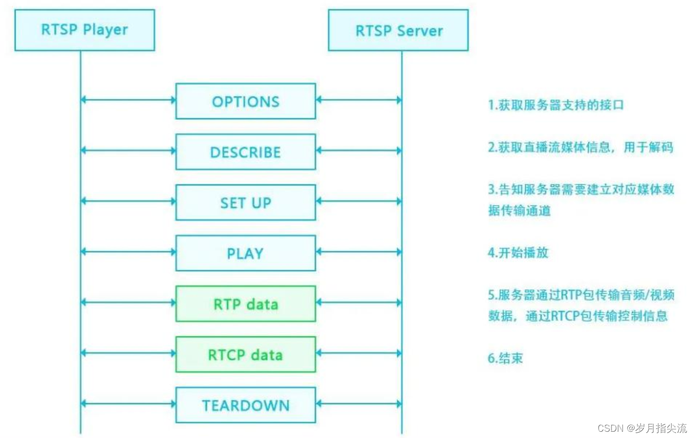

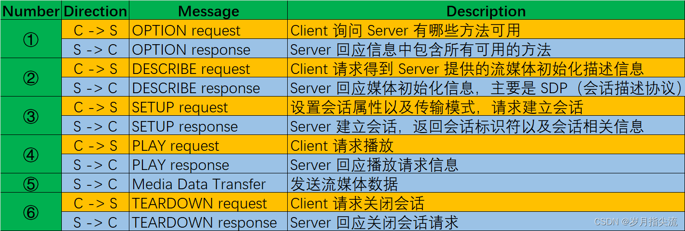

#### 3.1.1 排查问题操作

1. WireShark 选好网卡，过滤 `RTSP`，抓取 SETUP 和 PLAY，

2. SETUP 请求信息描述了期望音视频数据包基于 UDP 还是 TCP 传输，指定了 RTP，RTCP 端口，以及是单播还是组播等信息
3. 有 PLAY 后，且服务端返回200OK，开始推流

4. 客户端使用 VLC 拉流，一般URL为，`rtsp://ip:8554/test2`

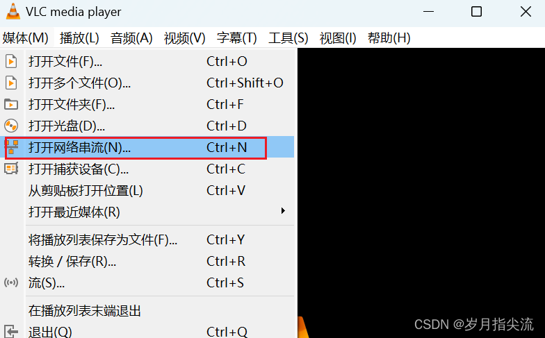

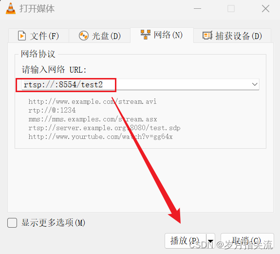


### 3.2 RTMP 协议

协议基于 TCP ，RTMP 与 HTTP 一样， 都属于 TCP/IP 四层模型的应用层，它有多种变种：

- RTMP 工作在 TCP 之上，默认使用端口 `1935`；
- RTMPE 在 RTMP 的基础上增加了加密功能；encrypt
- RTMPT 封装在 HTTP 请求之上，可穿透防火墙；http–rtmp
- RTMPS 类似 RTMPT，增加了 TLS/SSL 的安全功能；

> RTMP 协议传输时会对数据格式化，而实际传输的时候为了更好地实现多路复用、分包和信息的公平性，发送端会把 Message 划分为带有 Message ID 的 Chunk，每个 Chunk 可能是一个单独的 Message，也可能是 Message 的一部分，在接收端会根据 Chunk 中包含的 data 的长度，message id 和 message 的长度把 chunk 还原成完整的 Message，从而实现信息的收发。

#### 3.2.1 排查

类似 RTSP，`rtmp://192.168.36.176:1935/live/test1`

播放（Play）

- 客户端发送命令消息中的“播放” （play） 命令到服务器。
- 服务器发送用户控制消息中的 “stream begin” ，告知客户端流 ID
- 服务器发送客户端要播放的音频和视频数据

### 3.3 WebRTC 

网页实时通信，进行实时语音通话或视频聊天。

#### 3.3.1 与 WebSocket 区别

1. 用途区别

- WebSocket允许浏览器和Web服务器之间进行全双工通信.
- WebRTC允许两个浏览器之间的全双工通信。

2. 协议区别

- WebSocket使用TCP协议
- WebRTC使用UDP协议

3. 流量路径

- WebSocket 浏览需要经过服务器
- WebRTC 是直接连接，浏览不会经过第三方服务器，是一个去中心化的架构模型，简单说就是省带宽。

4. 实时性

- WebSocket延迟高（不是直接连接）
- WebRTC延迟低

通常WebRTC会与WebSocket配合使用，WebSocket的作用主要是用来交换客户端的SDP与网络信息，Websocket传输的内容与真正通信数据无关，只是协助WebRTC建立连接。

#### 3.3.2 抓包

WebRTC 音视频流传输是基于 RTP/RTCP（UDP），所以按照RTP的方法进行拉流播放

wirkshark 解码udp包为RTP

参考：[使用Wireshark抓包分析RTP协议_wireshark rtp流分析-CSDN博客](https://blog.csdn.net/m0_65890285/article/details/139062776)

[使用Wireshark提取RTP流中的原始码流-天翼云开发者社区 - 天翼云 (ctyun.cn)](https://www.ctyun.cn/developer/article/472217239793733)

[使用wireshark抓包RTP流 - 幻cat - 博客园 (cnblogs.com)](https://www.cnblogs.com/unrealCat/p/17445930.html)
