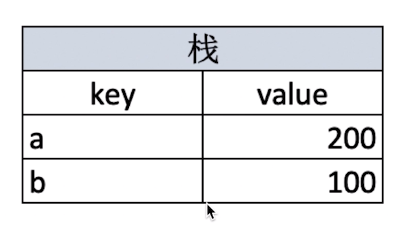
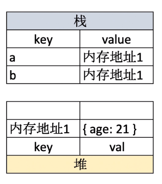

## 值类型和引用类型

- 值类型 的赋值不会相互干扰
- 引用类型（eg.对象）的赋值改变，原引用的对象也会改变

```js
let a = 1;
let b = a;
b = 2;
console.log(a); //1

let a = {age: 18};
let b = a;
b.age = 20;
console.log(a.age) //20
```

变量存储在 **栈（从上往下）**中



引用类型 存储在 **堆（从下往上）** 中，要想不相互干扰就会用到**深拷贝**。



## typeof和深拷贝

1. typeof可以识别所有的**值类型、函数、判断是否是引用类型（不可细分）**。

   具体：

   - 值类型：undefined、string、number、boolean、symbol
   - 引用类型：object（null、数组、对象）、function

2. 深拷贝

   > 当出现引用类型里的内容还有引用类型时，使用深拷贝
>
   > 注意：Object.assign不是深拷贝（数组/对象中的深层次，还是只拷贝了地址）

   两种方式：

   - `JSON.parse(JSON.stringify())`，**只能用于数组或对象**，有 function,undefined，则序列化的结果会把 function,undefined 丢失
   - for...in 递归（）
     - 判断是不是object或null，是的话直接返回
     - 判断是数组还是对象
     - 判读obj的内容是不是原型的属性
     
     - 递归调用，实现比如对象中的对象的拷贝
       
     ```js
      // for...in 递归
      function deepClone(obj = {}) {
     // 判断是不是对象或者为null
     if (typeof obj !== 'object' || obj === null) {
     	return obj;
     }
     // 判断是数组还是对象
     let res;
     if (obj instanceof Array) {
       res = []
     }else {
       res = {}
     }
     // 如果 i 是自身的属性为true，则递归调用来返回值（这样避免了来自原型的属性）
     for (let i in obj) {
      if (obj.hasOwnProperty(i))
      // 递归！！！
        res[i] = deepClone(obj[i])
     }
     return res;
      };
     ```

## 变量计算

类型转换：

1. 字符串拼接

   涉及到 `+` 法的运算，有字符类型的的话就是拼接，除非使用类型转换。

2.  `==` 运算符，会隐式类型转换。

   ```js
   100 == '100' // 都为true
   0 == ''
   0 == false
   fasle == ''
   null == undefined
   ```

   > 除了 `==  null` 之外，其他一律用 `===`  ，这相当于 `===null || ===undefined`

3. if 语句和逻辑运算

   ```js
   !!0 === false
   !!NAN === false
   !!'' === false
   !!null === false
   !!undefined === false
   !!false === false
   ```

   这些都是falsely变量，其他都是truly变量。

   ```js
   10 && 0 // 0
   '' || 'abc' // 'abc'
   !window.abc //true
   ```

   

