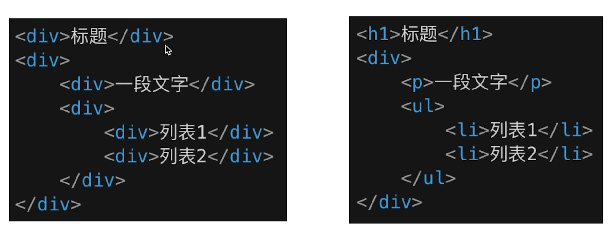
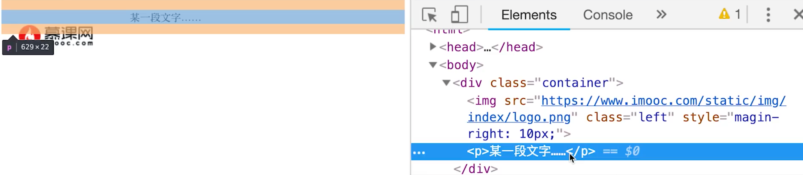
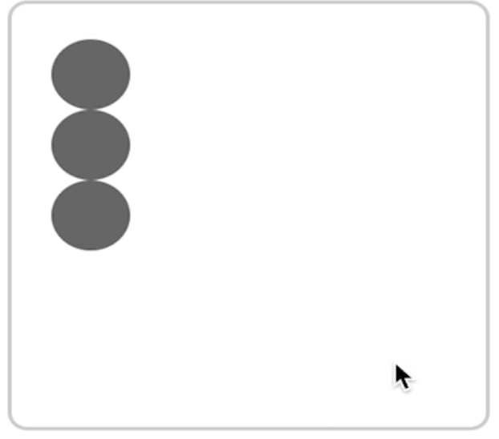
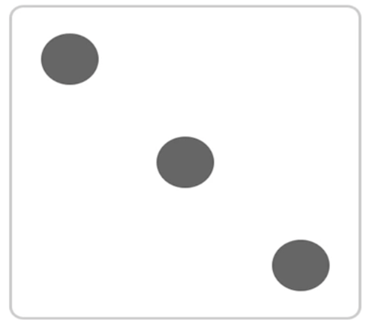

# 一、HTML 面试题

### 1.1 如何理解HTML 语义化



- 代码易读性
- 搜索引擎易读（SEO）

### 1.2 HTML中有哪些常见的标签是块状元素或内联元素

- 块状元素 `display: bloack/table`; 有 div h1 h2 table ul ol p 等==（独占一行）==
- 内联元素 `display: inline/inlie-block`; 有 span img input button 等

# 二、CSS 面试题

## 2.1 布局

### 2.1.1 盒模型的宽度如何计算

```html
// 如下代码，请问 div1 的 offsetwidth 是多大？

<style>
  #div1 {
    width: 100px;
    padding: 10px;
    border: 1px solid #ccc;
    margin: 10px;
  }
</style>

<div id="div1">
</div>
```

- offsetWidth  = （width+ padding+border），无margin，答案为 122px；

- 如果要变为100px，加 `box-sizing: border-box;`

### 2.1.2 margin 纵向重叠的问题

```html
//如下代码，AAA 和 BBB 之间的距离是多少？

<style>
  p {
  font-size: 16px;
  line-height: 1；
  margin-top: 10px;
  margin-bottom: 15px;
  }
</style>

<p>AAA</p>

<p></p>

<p></p>

<p></p>

＜p>BBB</p>
```

- 相邻元素的margin-top和margin-bottom会发生重叠
- 空白内容的`<p></p>` 也会重叠
- 答案： 15px  

### 2.1.3 margin 负值的问题

- 对margin的top left right bottom设置负值，有什么效果？
  - `margin-top`和`left` 负值，元素向上、向左移动
  - `margin-right`负值，右侧元素左移，自身不受影响（可以认为是自身宽度减少了）
  - `margin-bottom` 负值，下方元素上移，自身不受影响（可以认为是自身宽度减少了）

### 2.1.4 BFC的理解和应用

- 什么是BFC？如何应用？

  > ==块级格式化上下文==：是一块独立渲染区域，内部元素的渲染不会影响边界以外的元素。

- BFC的常见条件：

  - `float` 不是 `none`
  - `overflow` 不是 `visible`
  - `position` 是 `absolute` 或 `fixed`
  - `display` 是 `inline-block` 等

- 清除浮动

  

  图片脱离了文档流，给`container`和`p`标签加 `overflow: hidden`触发BFC

### 2.1.5 float布局及clearfix

- 如何实现圣杯布局和双飞翼布局

  > 1、三栏布局，中间一栏最先加载和渲染
  >
  > 2、两侧内容固定，中间宽度自适应

  **技术总结：**

  - 使用float布局
  - 两侧使用margin 负值，一边和中间内容横向重叠
  - 防止中间内容被两侧覆盖，圣杯用 padding，双飞翼用 margin 来留白。

  **圣杯布局：**

  ```html
  <style type="text/css">
      #container {
        padding-left: 200px;
        padding-right: 150px;
        overflow: auto;
      }
      #container p {
        float: left;
      }
      .center {
        width: 100%;
        background-color: lightcoral;
      }
      .left {
        width: 200px;
        margin-left: -100%;
        // 上移与center横向重合
        position: relative;
        left: -200px;
        // 左移padding-left: 200px
        background-color: lightcyan;
      }
      .right {
        width: 150px;
        margin-right: -150px;
        // 相当于自身宽度为0，就不会被挤下去了
        background-color: lightgreen;
      }
      .clearfix:after {
        content: "";
        display: table;
        clear: both;
      }
  </style>
  <body>
      <div id="container" class="clearfix">
        <p class="center">我是中间</p>
        <p class="left">我是左边</p>
        <p class="right">我是右边</p>
      </div>
  </body>
  ```

  **双飞翼布局：**

  ```html
  <style type="text/css">
    .float {
      float: left;
    }
    #main {
      width: 100%;
      height: 200px;
      background-color: lightpink;
    }
    #main-wrap {
      margin: 0 190px 0 150px;// 上右下左
    }
    #left {
      width: 150px;
      height: 200px;
      background-color: lightsalmon;
      margin-left: -100%;
    }
    #right {
      width: 190px;
      height: 200px;
      background-color: lightskyblue;
      margin-left: -190px;
      // margin-left的原因
    }
  </style>
  <body>
    <div id="main" class="float">
      <div id="main-wrap">main</div>
    </div>
    <div id="left" class="float">left</div>
    <div id="right" class="float">right</div>
  </body>
  ```

  > 子元素设置100%的时候，会根据父元素box-sizing属性来判断
  >
  > 1. 父元素box-sizing: content-box的时候，等于父元素的内容宽度
  > 2. 父元素box-sizing: border-box的时候，等于父元素的内容宽度减去边框和内边距
  >
  > **圣杯布局的right之所以能够用margin-right来调整位置，是因为他们三个子容器是处于同一个父容器里，而双飞翼布局中的main和right都是最外层的div，main的100%width要占整个viewport，如果让他们强行并列就会挤出viewport去**

- 手写clearfix

  ```css
  /* 手写 clearfix 放在父元素里面 */
  .clearfix:after {
      content: '';
      display: table;
      clear: both;
  }
  .clearfix {
    *zoom: 1; /* 兼容 IE 低版本 */
  }
  ```

### 2.1.6 flex 布局

[常用语法回顾](https://zhuanlan.zhihu.com/p/25303493)：

- flex-direction：**决定主轴的方向**
- flex-wrap：**决定容器内项目是否可换行**
- justify-content：**项目在主轴的对齐方式**
- align-items：**项目在交叉轴上的对齐方式**
- align-self：子元素在交叉轴的对齐方式

**flex 实现一个三点的色子** 

```html
<style type="text/css">
    .box {
        width: 200px;
        height: 200px;
        border: 2px solid #ccc;
        border-radius: 10px;
        padding: 20px;
  
        display: flex;
        justify-content: space-between;
    }
    .item {
        display: block;
        width: 40px;
        height: 40px;
        border-radius: 50%;
        background-color: #666;
    }
    .item:nth-child(2) {
        align-self: center;
    }
    .item:nth-child(3) {
        align-self: flex-end;
    }

</style>
</head>
<body>
    <div class="box">
        <span class="item"></span>
        <span class="item"></span>
        <span class="item"></span>
    </div>
</body>
```



## 2.2 定位

### 2.2.1 absolute和relative分别依据什么定位

- relative 根据自身定位
- absolute 根据最近一层的==定位元素==定位

**定位元素：**

- absolute relative fixed
- body

### 2.2.2 居中对齐有哪些实现方式

- 水平居中
  - inline 元素：text-aligin: center
  - block 元素：margin: auto
  - absolute 元素： left: 50% + margin-left 负值（必须要知道子元素的尺寸）
- 垂直居中
  - inline 元素：设置line-height 和 height 的值相等
  - absolute 元素： top: 50% + margin-top 负值 （必须要知道子元素的尺寸）
  - absolute 元素：transform: translate(-50%, -50%)（CSS3，结合left 和 top 50% 就可以垂直水平居中）
  - absolute 元素：top,left,bottom,right = 0 和 margin: auto

### 2.2.3 水平垂直居中多种实现方式

1. 利用绝对定位，设置 `left: 50%` 和 `top: 50%` 现将子元素左上角移到父元素中心位置，然后再通过 `translate` 来调整子元素的中心点到父元素的中心。该方法可以**不定宽高**。

```css
.father {
  position: relative;
}
.son {
  position: absolute;
  left: 50%;
  top: 50%;
  transform: translate(-50%, -50%);
}
复制代码
```

2. 利用绝对定位，子元素所有方向都为 `0` ，将 `margin` 设置为 `auto` ，由于宽高固定，对应方向实现平分，该方法必须**盒子有宽高**。

```css
.father {
  position: relative;
}
.son {
  position: absolute;
  top: 0;
  left: 0;
  right: 0;
  bottom: 0px;
  margin: auto;
  height: 100px;
  width: 100px;
}
复制代码
```

3. 利用绝对定位，设置 `left: 50%` 和 `top: 50%` 现将子元素左上角移到父元素中心位置，然后再通过 `margin-left` 和 `margin-top` 以子元素自己的一半宽高进行负值赋值。该方法**必须定宽高**。

```css
.father {
  position: relative;
}
.son {
  position: absolute;
  left: 50%;
  top: 50%;
  width: 200px;
  height: 200px;
  margin-left: -100px;
  margin-top: -100px;
}
复制代码
```

4. 利用 `flex` ，最经典最方便的一种了，不用解释，定不定宽高无所谓的。

```css
.father {
  display: flex;
  justify-content: center;
  align-items: center;
}
```

## 2.3 图文样式

### 2.3.1 line-height 如何继承

```html
<!-- 如下代码， p 标签的行高是多少 -->
<style type="text/css">
    body {
        font-size: 20px;
        line-height: 200%;
    }
    p {
        background-color: #ccc;
        font-size: 16px;
    }
</style>
</head>
<body>
    <p>这是一行文字</p>
</body>
<!-- 答案是 20*200% -->
```

- 写具体数值（50px）、比例（如1.5），则继承该数值、比例
- 写百分数（200%），则继承计算出来的值

## 2.4 响应式

### 2.4.1 rem 是什么

- rem，相对长度单位，相对于根元素（font-size）

- em，相对长度单位，相对于父元素，不常用

### 2.4.2 如何实现响应式

- media-query，根据不同的屏幕宽度设置根元素 font-size
- rem，基于根元素进行计算

### 2.4.3 vw/vh

rem 的弊端是有阶梯性的，必须把每个宽度范围的设置出来

> 网页视口尺寸：
>
> - window.screen.height  // 屏幕高度
> - window.innerHeight  // 网页视口高度（浏览器中可以显示网页内容的高度）
> - document.body.clientHeight  // body高度（内容的高度）

- vh 网页视口高度的 1/100
- vw 网页视口宽度的 1/100
- vmax 取两者最大值，vimn取两者最小值

直接使用

```html
width: 10vw;
height: 10vh;
// height: 10vmax;
```